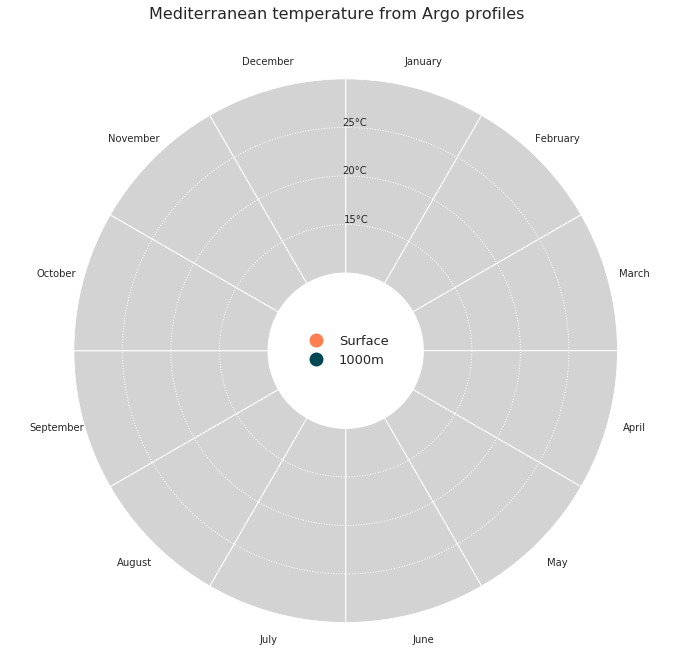
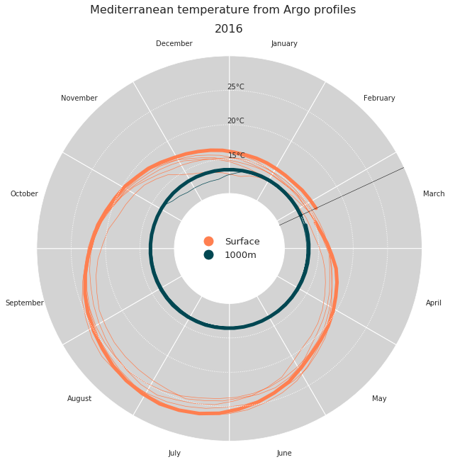
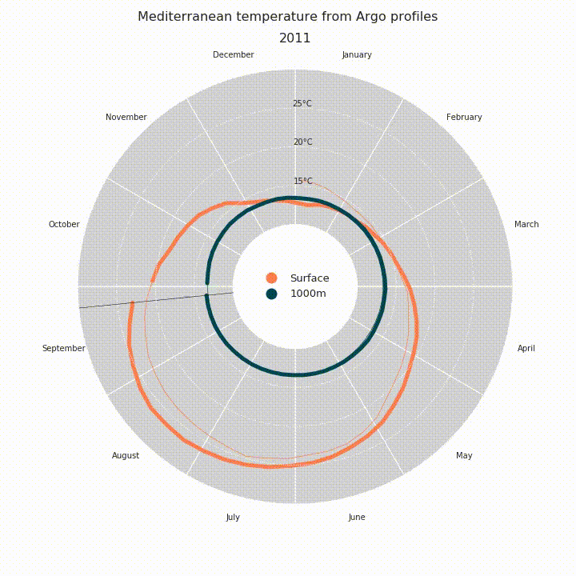

The **ocean** is a key component of the Earth climate system. It thus needs a continuous real-time monitoring to help scientists better understand its dynamic and predict its evolution. All around the world, oceanographers have managed to join their efforts and set up a [Global Ocean Observing System](https://www.goosocean.org) among which [**Argo**](http://www.argo.ucsd.edu/) is a key component. Argo is a global network of nearly 4000 autonomous probes or floats measuring pressure, temperature and salinity from the surface to 2000m depth every 10 days. The localisation of these floats is nearly random between the 60th parallels (see live coverage [here](http://collab.umr-lops.fr/app/divaa/)). All data are collected by satellite in real-time, processed by several data centers and finally merged in a single dataset (collecting more than 2 millions of vertical profiles data) made freely available to anyone.

In this particular case, we want to plot temperature (surface and 1000m deep) data measured by those floats, for the period 2010-2020 and for the Mediterranean sea. We want this plot to be circular and animated, now you start to get the title of this post: **Animated polar plot**.

First we need some data to work with. To retrieve our temperature values from Argo, we use [**Argopy**](https://argopy.readthedocs.io), which is a Python library that aims to ease Argo data access, manipulation and visualization for standard users, as well as Argo experts and operators. Argopy returns [xarray](http://xarray.pydata.org) dataset objects, which make our analysis much easier.
```python
import pandas as pd
import numpy as np
from argopy import DataFetcher as ArgoDataFetcher
argo_loader = ArgoDataFetcher(cache=True)
#
# Query surface and 1000m temp in Med sea with argopy
df1 = argo_loader.region([-1.2,29.,28.,46.,0,10.,'2009-12','2020-01']).to_xarray()
df2 = argo_loader.region([-1.2,29.,28.,46.,975.,1025.,'2009-12','2020-01']).to_xarray()
#
```

Here we create some arrays we'll use for plotting, we set up a date array and extract day of the year and year itself that will be usefull. Then to build our temperature array, we use xarray very usefull methods : `where()` and `mean()`. Then we build a pandas Dataframe, because it's prettier!
```python
# Weekly date array
daterange=np.arange('2010-01-01','2020-01-03',dtype='datetime64[7D]') 
dayoftheyear=pd.DatetimeIndex(np.array(daterange,dtype='datetime64[D]')+3).dayofyear # middle of the week
activeyear=pd.DatetimeIndex(np.array(daterange,dtype='datetime64[D]')+3).year # extract year

# Init final arrays
tsurf=np.zeros(len(daterange))
t1000=np.zeros(len(daterange))

# Filling arrays
for i in range(len(daterange)):
    i1=(df1['TIME']>=daterange[i])&(df1['TIME']<daterange[i]+7)    
    i2=(df2['TIME']>=daterange[i])&(df2['TIME']<daterange[i]+7)    
    tsurf[i]=df1.where(i1,drop=True)['TEMP'].mean().values
    t1000[i]=df2.where(i2,drop=True)['TEMP'].mean().values

# Creating dataframe    
d = {'date': np.array(daterange,dtype='datetime64[D]'), 'tsurf': tsurf, 't1000': t1000}
ndf = pd.DataFrame(data=d)
ndf.head()

	date 	tsurf 	t1000
0 	2009-12-31 	15.725000 	13.306133
1 	2010-01-07 	15.530414 	13.315658
2 	2010-01-14 	15.307378 	13.300347
3 	2010-01-21 	14.954195 	13.300647
4 	2010-01-28 	14.708816 	13.300274
```


Then it's time to plot, for that we first need to import what we need, and set some usefull variables.
```python
import matplotlib.pyplot as plt
import matplotlib
plt.rcParams['xtick.major.pad']='17'
plt.rcParams["axes.axisbelow"] = False
matplotlib.rc('axes',edgecolor='w')
from matplotlib.lines import Line2D
from matplotlib.animation import FuncAnimation
from IPython.display import HTML

big_angle= 360/12  # How we split our polar space
date_angle=((360/365)*dayoftheyear)*np.pi/180  # For a day, a corresponding angle
# inner and outer ring limit values
inner=10
outer=30
# setting our color values
ocean_color = ["#ff7f50","#004752"]
```

Now we want to make our axes like we want, for that we build a function `dress_axes` that will be called during the animation process. Here we plot some bars with an offset (combination of `bottom` and `ylim` after). Those bars are actually our background, and the offset allows us to plot a legend in the middle of the plot.
```python
def dress_axes(ax):
    ax.set_facecolor('w')
    ax.set_theta_zero_location("N")
    ax.set_theta_direction(-1)
    # Here is how we position the months labels
    middles=np.arange(big_angle/2 ,360, big_angle)*np.pi/180
    ax.set_xticks(middles)
    ax.set_xticklabels(['January', 'February', 'March', 'April', 'May', 'June', 'July', 'August','September','October','November','December'])
    ax.set_yticks([15,20,25])
    ax.set_yticklabels(['15°C','20°C','25°C'])
    # Changing radial ticks angle
    ax.set_rlabel_position(359)
    ax.tick_params(axis='both',color='w')
    plt.grid(None,axis='x')
    plt.grid(axis='y',color='w', linestyle=':', linewidth=1)    
    # Here is the bar plot that we use as background
    bars = ax.bar(middles, outer, width=big_angle*np.pi/180, bottom=inner, color='lightgray', edgecolor='w',zorder=0)
    plt.ylim([2,outer])
    # Custom legend
    legend_elements = [Line2D([0], [0], marker='o', color='w', label='Surface', markerfacecolor=ocean_color[0], markersize=15),
                       Line2D([0], [0], marker='o', color='w', label='1000m', markerfacecolor=ocean_color[1], markersize=15),
                       ]
    ax.legend(handles=legend_elements, loc='center', fontsize=13, frameon=False)
    # Main title for the figure
    plt.suptitle('Mediterranean temperature from Argo profiles',fontsize=16,horizontalalignment='center')
```
From there we can plot the frame of our plot.
```python
fig = plt.figure(figsize=(10,10))
ax = fig.add_subplot(111, polar=True)
dress_axes(ax)
plt.show()
```



Then it's finally time to plot our data. Since we want to animated the plot, we'll build a function that will be called in `FuncAnimation` later on. Since the state of the plot changes on every time stamp, we have to redress the axes for each frame, easy with our `dress_axes` function. Then we plot our temperature data using basic `plot()`: thin lines for historical measurements, thicker lines for the current year.
```python
def draw_data(i):       
    # Clear
    ax.cla()
    # Redressing axes
    dress_axes(ax)
    # Limit between thin lines and thick line, this is current date minus 51 weeks basically.
    # why 51 and not 52 ? That create a small gap before the current date, which is prettier
    i0=np.max([i-51,0])

    ax.plot(date_angle[i0:i+1], ndf['tsurf'][i0:i+1],'-',color=ocean_color[0],alpha=1.0,linewidth=5)     
    ax.plot(date_angle[0:i+1], ndf['tsurf'][0:i+1],'-',color=ocean_color[0],linewidth=0.7)     

    ax.plot(date_angle[i0:i+1], ndf['t1000'][i0:i+1],'-',color=ocean_color[1],alpha=1.0,linewidth=5)     
    ax.plot(date_angle[0:i+1], ndf['t1000'][0:i+1],'-',color=ocean_color[1],linewidth=0.7)     

    # Plotting a line to spot the current date easily
    ax.plot([date_angle[i],date_angle[i]],[inner,outer],'k-',linewidth=0.5)
    # Display the current year as a title, just beneath the suptitle
    plt.title(str(activeyear[i]),fontsize=16,horizontalalignment='center')

# Test it
draw_data(322)
plt.show()
```



Finally it's time to animate, using `FuncAnimation`. Then we save it as a mp4 file or we display it in our notebook with `HTML(anim.to_html5_video())`.
```python
anim = FuncAnimation(fig, draw_data, interval=40, frames=len(daterange)-1, repeat=False)    
#anim.save('ArgopyUseCase_MedTempAnimation.mp4')   
HTML(anim.to_html5_video())
```

