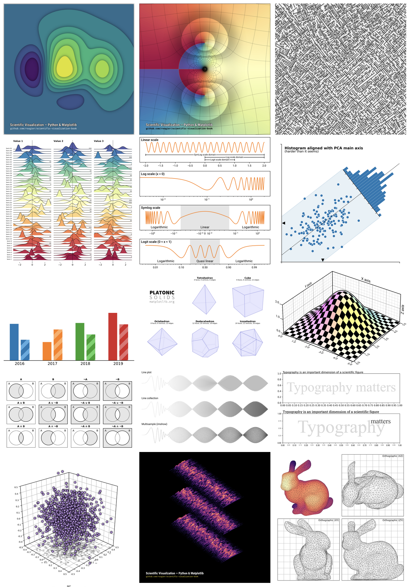

It's my great pleasure to announce that I've finished my book on matplotlib and it is now freely available at https://www.labri.fr/perso/nrougier/scientific-visualization.html while sources for the book are hosted at github.com/rougier/scientific-visualization-book.

## Abstract

The Python scientific visualisation landscape is huge. It is composed of a myriad of tools, ranging from the most versatile and widely used down to the more specialised and confidential. Some of these tools are community based while others are developed by companies. Some are made specifically for the web, others are for the desktop only, some deal with 3D and large data, while others target flawless 2D rendering. In this landscape, Matplotlib has a very special place. It is a versatile and powerful library that allows you to design very high quality figures, suitable for scientific publishing. It also offers a simple and intuitive interface as well as an object oriented architecture that allows you to tweak anything within a figure. Finally, it can be used as a regular graphic library in order to design non‐scientific figures. This book is organized into four parts. The first part considers the fundamental principles of the Matplotlib library. This includes reviewing the different parts that constitute a figure, the different coordinate systems, the available scales and projections, and we’ll also introduce a few concepts related to typography and colors. The second part is dedicated to the actual design of a figure. After introducing some simple rules for generating better figures, we’ll then go on to explain the Matplotlib defaults and styling system before diving on into figure layout organization. We’ll then explore the different types of plot available and see how a figure can be ornamented with different elements. The third part is dedicated to more advanced concepts, namely 3D figures, optimization & animation. The fourth and final part is a collection of showcases.

### Book gallery

