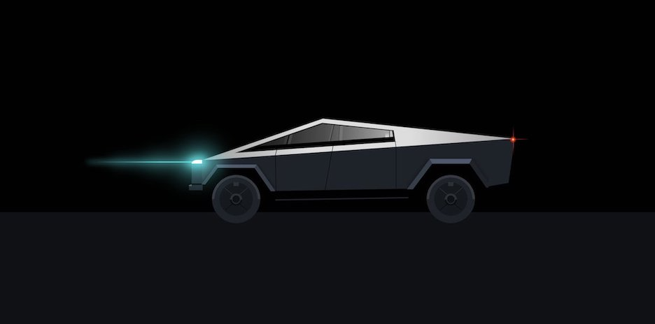
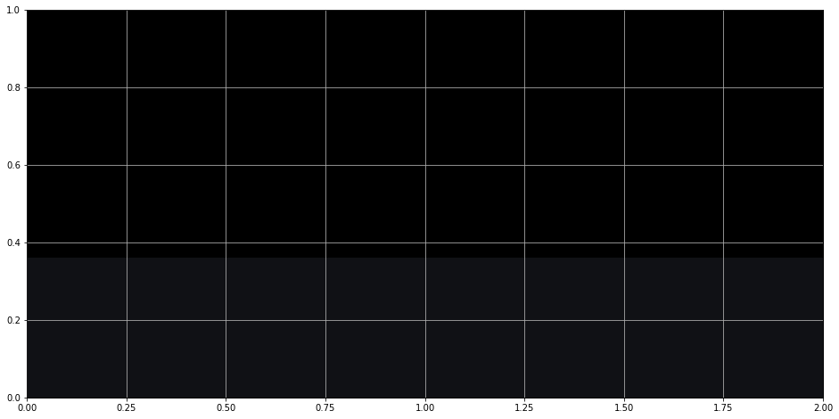
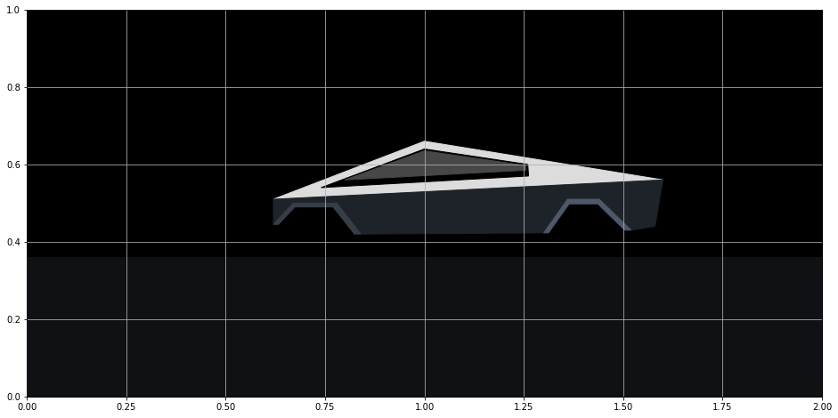
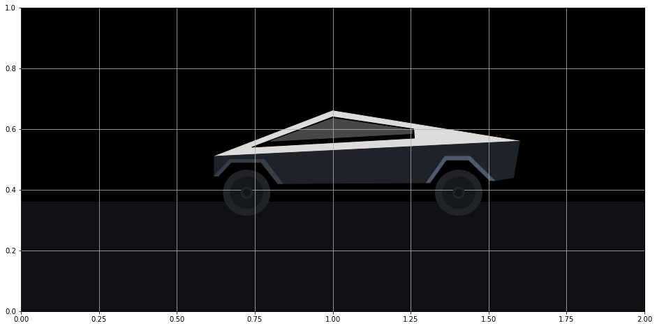
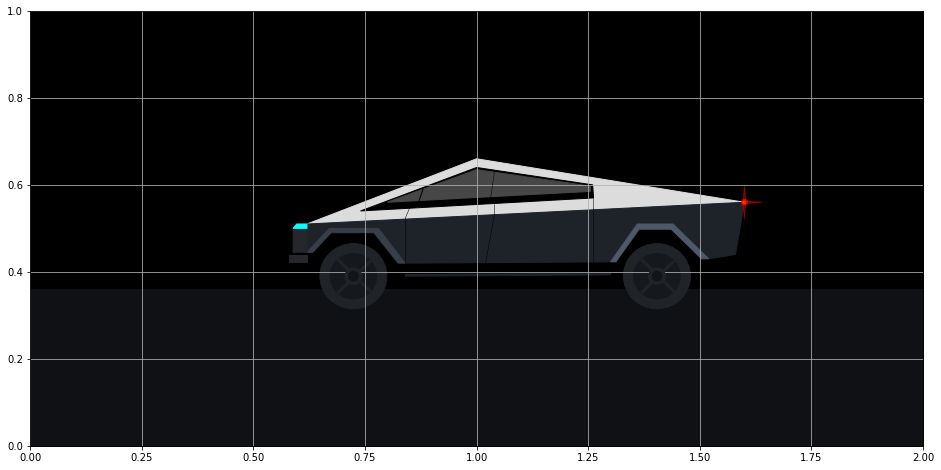
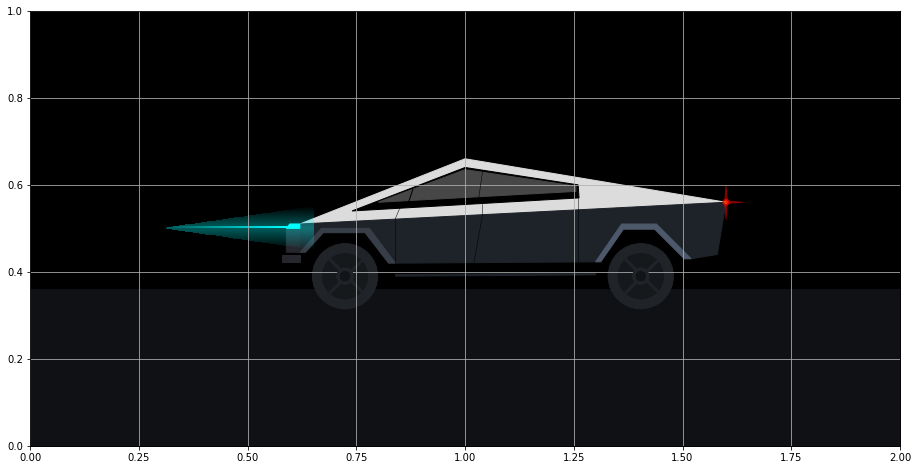

# Create a Tesla Cybertruck that Drives

My name is [Ted Petrou][0], founder of [Dunder Data][1], and in this tutorial you will learn how to create the new [Tesla Cybertruck][2] using matplotlib. I was inspired by the image below which was originally created by [Lynn Fisher][3] (without matplotlib).



[0]: https://wwww.twitter.com/tedpetrou
[1]: https://www.dunderdata.com
[2]: https://www.tesla.com/cybertruck
[3]: https://twitter.com/lynnandtonic/status/1197989912970067969?lang=en

Before going into detail, let's jump to the results. Here is the completed recreation of the Tesla Cybertruck that drives off the screen.


  <video width="700" height="500" controls>
  <source src="tesla_animate.mp4" type="video/mp4">
</video>


## Tutorial

A tutorial now follows containing all the steps that creates a Tesla Cybertruck that drives. It covers the following topics:

* Figure and Axes setup
* Adding shapes
* Color gradients
* Animation

Understanding these topics should give you enough to start animating your own figures in matplotlib. This tutorial is not suited for those with no matplotlib experience. You need to understand the relationship between the Figure and Axes and how to use the object-oriented interface of matplotlib.

### Figure and Axes setup

We first create a matplotlib Figure without any Axes (the plotting surface). The function `create_axes` adds an Axes to the Figure, sets the x-limits to be twice the y-limits (to match the ratio of the figure dimensions (16 x 8)), fills in the background with two different dark colors using `fill_between`, and adds grid lines to make it easier to plot the objects in the exact place you desire. Set the `draft` parameter to `False` when you want to remove the grid lines, tick marks, and tick labels.

```python
import numpy as np
import matplotlib.pyplot as plt
%matplotlib inline

fig = plt.Figure(figsize=(16, 8))

def create_axes(draft=True):
    ax = fig.add_subplot()
    ax.grid(True)
    ax.set_ylim(0, 1)
    ax.set_xlim(0, 2)
    ax.fill_between(x=[0, 2], y1=.36, y2=1, color='black')
    ax.fill_between(x=[0, 2], y1=0, y2=.36, color='#101115')
    if not draft:
        ax.grid(False)
        ax.axis('off')

create_axes()
fig
```



### Shapes in matplotlib

Most of the Cybertruck is composed of shapes (patches in matplotlib terminology) - circles, rectangles, and polygons. These shapes are available in the patches matplotlib module. After importing, we instantiate single instances of these patches and then call the `add_patch` method to add the patch to the Axes.

For the Cybertruck, I used three patches, `Polygon`, `Rectangle`, and `Circle`. They each have different parameters available in their constructor. I first constructed the body of the car as four polygons. Two other polygons were used for the rims. Each polygon is provided a list of x, y coordinates where the corner points are located. Matplotlib connects all the points in the order given and fills it in with the provided color.

Notice how the Axes is retrieved as the first line of the function. This is used throughout the tutorial.

```python
from matplotlib.patches import Polygon, Rectangle, Circle

def create_body():
    ax = fig.axes[0]
    top = Polygon([[.62, .51], [1, .66], [1.6, .56]], color='#DCDCDC')
    windows = Polygon([[.74, .54], [1, .64], [1.26, .6], [1.262, .57]], color='black')
    windows_bottom = Polygon([[.8, .56], [1, .635], [1.255, .597],
                              [1.255, .585]], color='#474747')
    base = Polygon([[.62, .51], [.62, .445], [.67, .5], [.78, .5], [.84, .42],
                    [1.3, .423], [1.36, .51], [1.44, .51], [1.52, .43], [1.58, .44],
                    [1.6, .56]], color="#1E2329")
    left_rim = Polygon([[.62, .445], [.67, .5], [.78, .5], [.84, .42],
                        [.824, .42], [.77, .49],[.674, .49], [.633, .445]], color='#373E48')
    right_rim = Polygon([[1.3, .423], [1.36, .51], [1.44, .51], [1.52, .43],
                         [1.504, .43], [1.436, .498], [1.364, .498],
                         [1.312, .423]], color='#4D586A')
    ax.add_patch(top)
    ax.add_patch(windows)
    ax.add_patch(windows_bottom)
    ax.add_patch(base)
    ax.add_patch(left_rim)
    ax.add_patch(right_rim)

create_body()
fig
```



#### Tires

I used three `Circle` patches for each of the tires. You must provide the center and radius. For the innermost circles (the "spokes"), I've set the `zorder` to 99. The `zorder` determines the order of how plotting objects are layered on top of each other. The higher the number, the higher up on the stack of layers the object will be plotted. During the next step, we will draw some rectangles through the tires and they need to be plotted underneath these spokes.

```python
def create_tires():
    ax = fig.axes[0]
    left_tire = Circle((.724, .39), radius=.075, color="#202328")
    right_tire = Circle((1.404, .39), radius=.075, color="#202328")
    left_inner_tire = Circle((.724, .39), radius=.052, color="#15191C")
    right_inner_tire = Circle((1.404, .39), radius=.052, color="#15191C")
    left_spoke = Circle((.724, .39), radius=.019, color="#202328", zorder=99)
    right_spoke = Circle((1.404, .39), radius=.019, color="#202328", zorder=99)
    left_inner_spoke = Circle((.724, .39), radius=.011, color="#131418", zorder=99)
    right_inner_spoke = Circle((1.404, .39), radius=.011, color="#131418", zorder=99)

    ax.add_patch(left_tire)
    ax.add_patch(right_tire)
    ax.add_patch(left_inner_tire)
    ax.add_patch(right_inner_tire)
    ax.add_patch(left_spoke)
    ax.add_patch(right_spoke)
    ax.add_patch(left_inner_spoke)
    ax.add_patch(right_inner_spoke)

create_tires()
fig
```



#### Axels

I used the `Rectangle` patch to represent the two 'axels' (this isn't the correct term, but you'll see what I mean) going through the tires. You must provide a coordinate for the lower left corner, a width, and a height. You can also provide it an angle (in degrees) to control its orientation. Notice that they go under the spokes plotted from above. This is due to their lower `zorder`.

```python
def create_axels():
    ax = fig.axes[0]
    left_left_axel = Rectangle((.687, .427), width=.104, height=.005, angle=315, color='#202328')
    left_right_axel = Rectangle((.761, .427), width=.104, height=.005, angle=225, color='#202328')
    right_left_axel = Rectangle((1.367, .427), width=.104, height=.005, angle=315, color='#202328')
    right_right_axel = Rectangle((1.441, .427), width=.104, height=.005, angle=225, color='#202328')

    ax.add_patch(left_left_axel)
    ax.add_patch(left_right_axel)
    ax.add_patch(right_left_axel)
    ax.add_patch(right_right_axel)

create_axels()
fig
```


#### Other details

The front bumper, head light, tail light, door and window lines are added below. I used regular matplotlib lines for some of these. Those lines are not patches and get added directly to the Axes without any other additional method.

```python
def create_other_details():
    ax = fig.axes[0]
    # other details
    front = Polygon([[.62, .51], [.597, .51], [.589, .5], [.589, .445], [.62, .445]], color='#26272d')
    front_bottom = Polygon([[.62, .438], [.58, .438], [.58, .423], [.62, .423]], color='#26272d')
    head_light = Polygon([[.62, .51], [.597, .51], [.589, .5], [.589, .5], [.62, .5]], color='aqua')
    step = Polygon([[.84, .39], [.84, .394], [1.3, .397], [1.3, .393]], color='#1E2329')

    # doors
    ax.plot([.84, .84], [.42, .523], color='black', lw=.5)
    ax.plot([1.02, 1.04], [.42, .53], color='black', lw=.5)
    ax.plot([1.26, 1.26], [.42, .54], color='black', lw=.5)
    ax.plot([.84, .85], [.523, .547], color='black', lw=.5)
    ax.plot([1.04, 1.04], [.53, .557], color='black', lw=.5)
    ax.plot([1.26, 1.26], [.54, .57], color='black', lw=.5)

    # window lines
    ax.plot([.87, .88], [.56, .59], color='black', lw=1)
    ax.plot([1.03, 1.04], [.56, .63], color='black', lw=.5)

    # tail light
    tail_light = Circle((1.6, .56), radius=.007, color='red', alpha=.6)
    tail_light_center = Circle((1.6, .56), radius=.003, color='yellow', alpha=.6)
    tail_light_up = Polygon([[1.597, .56], [1.6, .6], [1.603, .56]], color='red', alpha=.4)
    tail_light_right = Polygon([[1.6, .563], [1.64, .56], [1.6, .557]], color='red', alpha=.4)
    tail_light_down = Polygon([[1.597, .56], [1.6, .52], [1.603, .56]], color='red', alpha=.4)

    ax.add_patch(front)
    ax.add_patch(front_bottom)
    ax.add_patch(head_light)
    ax.add_patch(step)
    ax.add_patch(tail_light)
    ax.add_patch(tail_light_center)
    ax.add_patch(tail_light_up)
    ax.add_patch(tail_light_right)
    ax.add_patch(tail_light_down)

create_other_details()
fig
```



#### Color gradients for the head light beam

The head light beam has a distinct color gradient that dissipates into the night sky. This is challenging to complete. I found an [excellent answer on Stack Overflow from user Joe Kington][0] on how to do this. We begin by using the `imshow` function which creates images from 3-dimensional arrays. Our image will simply be a rectangle of colors.

We create a 1 x 100 x 4 array that represents 1 row by 100 columns of points of RGBA (red, green, blue, alpha) values. Every point is given the same red, green, and blue values of (0, 1, 1) which represents the color 'aqua'. The alpha value represents opacity and ranges between 0 and 1 with 0 being completely transparent (invisible) and 1 being opaque. We would like the opacity to decrease as the light extends further from the head light (that is further to the left). The numpy `linspace` function is used to create an array of 100 numbers increasing linearly from 0 to 1. This array will be set as the alpha values.

The `extent` parameter defines the rectangular region where the image will be shown. The four values correspond to xmin, xmax, ymin, and ymax. The 100 alpha values will be mapped to this region beginning from the left. The array of alphas begins at 0, which means that the very left of this rectangular region will be transparent. The opacity will increase moving to the right-side of the rectangle where it eventually reaches 1.

[0]: https://stackoverflow.com/questions/29321835/is-it-possible-to-get-color-gradients-under-curve-in-matplotlib

```python
import matplotlib.colors as mcolors

def create_headlight_beam():
    ax = fig.axes[0]
    z = np.empty((1, 100, 4), dtype=float)
    rgb = mcolors.colorConverter.to_rgb('aqua')
    alphas = np.linspace(0, 1, 100)
    z[:, :, :3] = rgb
    z[:, :, -1] = alphas
    im = ax.imshow(z, extent=[.3, .589, .501, .505], zorder=1)

create_headlight_beam()
fig
```


#### Headlight Cloud

The cloud of points surrounding the headlight beam is even more challenging to complete. This time, a 100 x 100 grid of points was used to control the opacity. The opacity is directly proportional to the vertical distance from the center beam. Additionally, if a point was outside of the diagonal of the rectangle defined by `extent`, its opacity was set to 0.

```python
def create_headlight_cloud():
    ax = fig.axes[0]
    z2 = np.empty((100, 100, 4), dtype=float)
    rgb = mcolors.colorConverter.to_rgb('aqua')
    z2[:, :, :3] = rgb
    for j, x in enumerate(np.linspace(0, 1, 100)):
        for i, y in enumerate(np.abs(np.linspace(-.2, .2, 100))):
            if x * .2 > y:
                z2[i, j, -1] = 1 - (y + .8) ** 2
            else:
                z2[i, j, -1] = 0
    im2 = ax.imshow(z2, extent=[.3, .65, .45, .55], zorder=1)

create_headlight_cloud()
fig
```



### Creating a Function to Draw the Car

All of our work from above can be placed in a single function that draws the car. This will be used when initializing our animation. Notice, that the first line of the function clears the Figure, which removes our Axes. If we don't clear the Figure, then we will keep adding more and more Axes each time this function is called. Since this is our final product, we set `draft` to `False`.

```python
def draw_car():
    fig.clear()
    create_axes(draft=False)
    create_body()
    create_tires()
    create_axels()
    create_other_details()
    create_headlight_beam()
    create_headlight_beam()

draw_car()
fig
```


## Animation

Animation in matplotlib is fairly straightforward. You must create a function that updates the position of the objects in your figure for each frame. This function is called repeatedly for each frame.

In the `update` function below, we loop through each patch, line, and image in our Axes and reduce the x-value of each plotted object by .015. This has the effect of moving the truck to the left. The trickiest part was changing the x and y values for the rectangular tire 'axels' so that it appeared that the tires were rotating. Some basic trigonometry helps calculate this.

Implicitly, matplotlib passes the update function the frame number as an integer as the first argument. We accept this input as the parameter `frame_number`. We only use it in one place, and that is to do nothing during the first frame.

Finally, the `FuncAnimation` class from the animation module is used to construct the animation. We provide it our original Figure, the function to update the Figure (`update`), a function to initialize the Figure (`draw_car`), the total number of frames, and any extra arguments used during update (`fargs`).

```python
from matplotlib.animation import FuncAnimation

def update(frame_number, x_delta, radius, angle):
    if frame_number == 0:
        return
    ax = fig.axes[0]
    for patch in ax.patches:
        if isinstance(patch, Polygon):
            arr = patch.get_xy()
            arr[:, 0] -= x_delta
        elif isinstance(patch, Circle):
            x, y = patch.get_center()
            patch.set_center((x - x_delta, y))
        elif isinstance(patch, Rectangle):
            xd_old = -np.cos(np.pi * patch.angle / 180) * radius
            yd_old = -np.sin(np.pi * patch.angle / 180) * radius
            patch.angle += angle
            xd = -np.cos(np.pi * patch.angle / 180) * radius
            yd = -np.sin(np.pi * patch.angle / 180) * radius
            x = patch.get_x()
            y = patch.get_y()
            x_new = x - x_delta + xd - xd_old
            y_new = y + yd - yd_old
            patch.set_x(x_new)
            patch.set_y(y_new)

    for line in ax.lines:
        xdata = line.get_xdata()
        line.set_xdata(xdata - x_delta)

    for image in ax.images:
        extent = image.get_extent()
        extent[0] -= x_delta
        extent[1] -= x_delta

animation = FuncAnimation(fig, update, init_func=draw_car, frames=110,
                          repeat=False, fargs=(.015, .052, 4))
```

### Save animation

Finally, we can save the animation as an mp4 file (you must have ffmpeg installed for this to work). We set the frames-per-second (`fps`) to 30. From above, the total number of frames is 110 (enough to move the truck off the screen) so the video will last nearly four seconds (110 / 30).

```python
animation.save('tesla_animate.mp4', fps=30, bitrate=3000)
```


  <video width="700" height="500" controls>
  <source src="tesla_animate.mp4" type="video/mp4">
</video>


## Continue Animating

I encourage you to add more components to your Cybertruck animation to personalize the creation. I suggest encapsulating each addition with a function as done in this tutorial.


