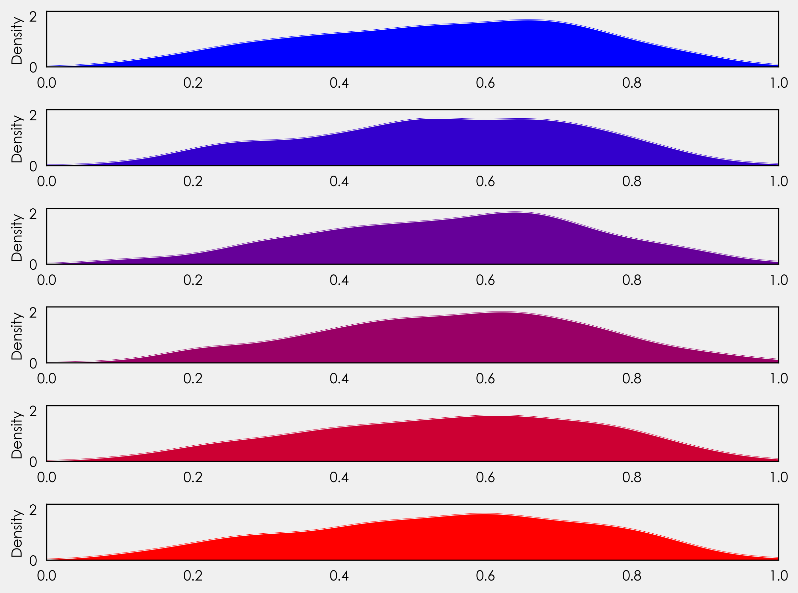
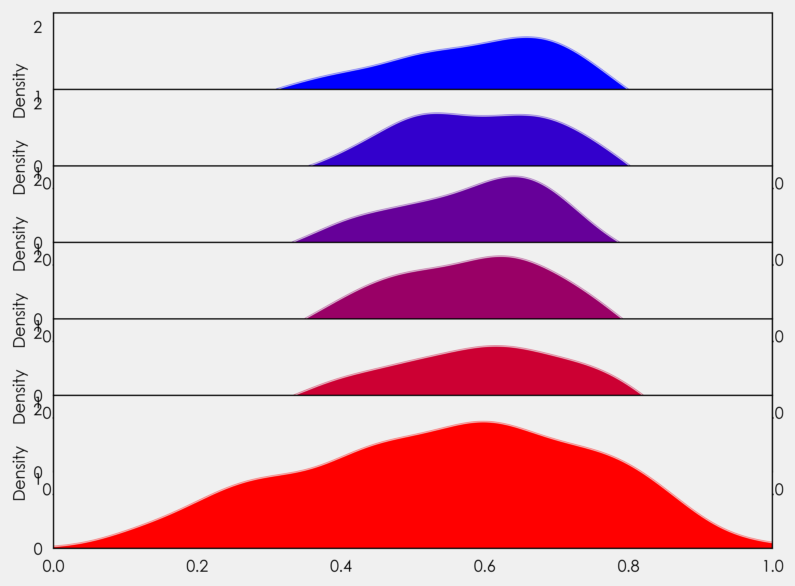
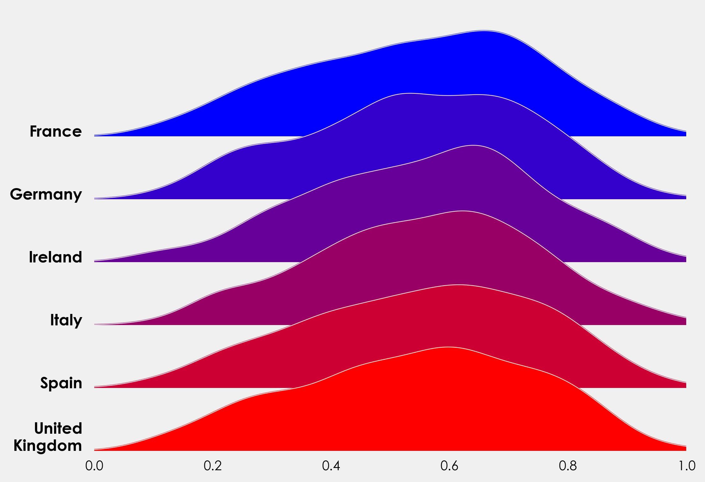
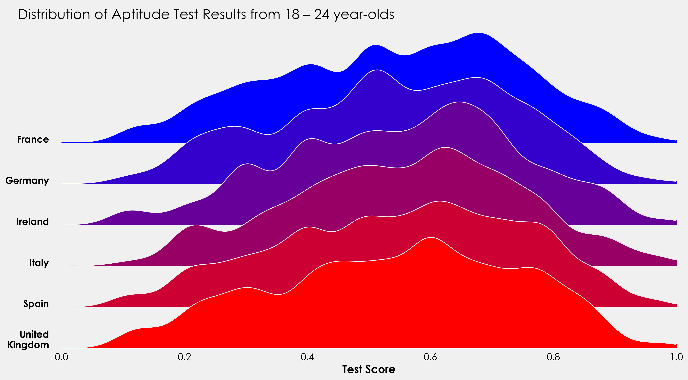

# Introduction

This post will outline how we can leverage [gridspec](https://matplotlib.org/3.1.3/api/_as_gen/matplotlib.gridspec.GridSpec.html) to create ridgeplots in Matplotlib. While this is a relatively straightforward tutorial, some experience working with sklearn would be beneficial. Naturally it being a _vast_ undertaking, this will not be an sklearn tutorial, those interested can read through the docs [here](https://scikit-learn.org/stable/user_guide.html). However, I will use its `KernelDensity` module from `sklearn.neighbors`.

<!--
# Contents
  - [Packages](#packages)
  - [Data](#data)
  - [GridSpec](gs1)
  - [Kernel Density Estimation](#kde)
  - [Overlapping Axes Objects](#gs2)
  - [Complete Snippet](#snippet)
 -->


### Packages <a id="packages"></a>


````
import pandas as pd
import numpy as np
from sklearn.neighbors import KernelDensity

import matplotlib as mpl
import matplotlib.pyplot as plt
import matplotlib.gridspec as grid_spec
````

### Data <a id="data"></a>

I'll be using some mock data I created. You can grab the dataset from GitHub [here](https://github.com/petermckeever/mock-data/blob/master/datasets/mock-european-test-results.csv) if you want to play along. The data looks at aptitude test scores broken down by country, age, and sex.

````
data = pd.read_csv("mock-european-test-results.csv")
````


| country | age | sex | score |
| ----  |----|----| ---- |
| Italy | 21 | female | 0.77 |
| Spain | 20 | female | 0.87 |
| Italy | 24 | female | 0.39 |
| United Kingdom | 20 | female | 0.70 |
| Germany | 20 | male | 0.25 |
| ... | | | |


### GridSpec <a id="gs1"></a>
GridSpec is a matplotlib module that allows us easy creation of subplots. We can control the number of subplots, the positions, the height, width, and spacing between each. As a basic example, let's create a quick template. The key parameters we'll be focusing on are `nrows`, `ncols`, and `width_ratios`.

`nrows`and `ncols` divide our figure into areas we can add axes to. `width_ratios`controls the width of each of our columns. If we create something like `GridSpec(2,2,width_ratios=[2,1])`, we are subsetting our figure into 2 rows, 2 columns, and setting our width ratio to 2:1, i.e., that the first column will take up two times the width of the figure.

What's great about GridSpec is that now we have created those subsets, we are not _bound_ to them, as we will see below.

**Note**: I am using my own theme, so plots will look different. Creating custom themes is outside the scope of this tutorial (but I may write one in the future).


````
gs = (grid_spec.GridSpec(2,2,width_ratios=[2,1]))

fig = plt.figure(figsize=(8,6))

ax = fig.add_subplot(gs[0:1,0])
ax1 = fig.add_subplot(gs[1:,0])
ax2 = fig.add_subplot(gs[0:,1:])

ax_objs = [ax,ax1,ax2]
n = ["",1,2]

i = 0
for ax_obj in ax_objs:
    ax_obj.text(0.5,0.5,"ax{}".format(n[i]),
                ha="center",color="red",
                fontweight="bold",size=20)
    i += 1

plt.show()
````


I won't get into more detail about what everything does here. If you are interested in learning more about figures, axes, and gridspec, Akash Palrecha has [written a very nice guide here](https://matplotlib.org/matplotblog/posts/an-inquiry-into-matplotlib-figures/).

### Kernel Density Estimation <a id="kde"></a>

We have a couple of options here. The easiest by far is to stick with the pipes built into pandas. All that's needed is to select the column and add `plot.kde`. This defaults to a Scott bandwidth method, but you can choose a Silverman method, or add your own. Let's use GridSpec again to plot the distribution for each country. First we'll grab the unique country names and create a list of colors.

````
countries = [x for x in np.unique(data.country)]
colors = ['#0000ff', '#3300cc', '#660099', '#990066', '#cc0033', '#ff0000']
````
Next we'll loop through each country and color to plot our data. Unlike the above we will not explicitly declare how many rows we want to plot. The reason for this is to make our code more dynamic. If we set a specific number of rows and specific number of axes objects, we're creating inefficient code. This is a bit of an aside, but when creating visualizations, you should always aim to reduce and reuse. By reduce, we specifically mean lessening the number of variables we are declaring and the unnecessary code associated with that. We are plotting data for six countries, what happens if we get data for 20 countries? That's a lot of additional code. Related, by not explicitly declaring those variables we make our code adaptable and ready to be scripted to automatically create new plots when new data of the same kind becomes available.

````
gs = (grid_spec.GridSpec(len(countries),1))

fig = plt.figure(figsize=(8,6))

i = 0

#creating empty list
ax_objs = []

for country in countries:
    # creating new axes object and appending to ax_objs
    ax_objs.append(fig.add_subplot(gs[i:i+1, 0:]))

    # plotting the distribution
    plot = (data[data.country == country]
            .score.plot.kde(ax=ax_objs[-1],color="#f0f0f0", lw=0.5)
           )

    # grabbing x and y data from the kde plot
    x = plot.get_children()[0]._x
    y = plot.get_children()[0]._y

    # filling the space beneath the distribution
    ax_objs[-1].fill_between(x,y,color=colors[i])

    # setting uniform x and y lims
    ax_objs[-1].set_xlim(0, 1)
    ax_objs[-1].set_ylim(0,2.2)

    i += 1

plt.tight_layout()
plt.show()
````



We're not quite at ridge plots yet, but let's look at what's going on here. You'll notice instead of setting an explicit number of rows, we've set it to the length of our countries list - `gs = (grid_spec.GridSpec(len(countries),1))`. This gives us flexibility for future plotting with the ability to plot more or less countries without needing to adjust the code.

Just after the for loop we create each axes object: `ax_objs.append(fig.add_subplot(gs[i:i+1, 0:]))`. Before the loop we declared `i = 0`. Here we are saying create axes object from row 0 to 1, the next time the loop runs it creates an axes object from row 1 to 2, then 2 to 3, 3 to 4, and so on.

Following this we can use `ax_objs[-1]` to access the last created axes object to use as our plotting area.

Next, we create the kde plot. We declare this as a variable so we can retrieve the x and y values to use in the `fill_between` that follows.


### Overlapping Axes Objects <a id="gs2"></a>

Once again using GridSpec, we can adjust the spacing between each of the subplots. We can do this by adding one line outside of the loop before `plt.tight_layout()`The exact value will depend on your distribution so feel free to play around with the exact value:

````    
gs.update(hspace= -0.5)
````


Now our axes objects are overlapping! Great-ish. Each axes object is hiding the one layered below it. We _could_ just add `ax_objs[-1].axis("off")` to our for loop, but if we do that we will lose our xticklabels. Instead we will create a variable to access the background of each axes object, and we will loop through each line of the border (spine) to turn them off. As we _only_ need the xticklabels for the final plot, we will add an if statement to handle that. We will also add in our country labels here. In our for loop we add:

````
# make background transparent
rect = ax_objs[-1].patch
rect.set_alpha(0)

# remove borders, axis ticks, and labels
ax_objs[-1].set_yticklabels([])
ax_objs[-1].set_ylabel('')

if i == len(countries)-1:
    pass
else:
    ax_objs[-1].set_xticklabels([])

spines = ["top","right","left","bottom"]
for s in spines:
    ax_objs[-1].spines[s].set_visible(False)

country = country.replace(" ","\n")
ax_objs[-1].text(-0.02,0,country,fontweight="bold",fontsize=14,ha="center")

````


As an alternative to the above, we can use the `KernelDensity` module from `sklearn.neighbors` to create our distribution. This gives us a bit more control over our bandwidth. The method here is taken from Jake VanderPlas's fantastic _Python Data Science Handbook_, you can read his full excerpt [here](https://jakevdp.github.io/PythonDataScienceHandbook/05.13-kernel-density-estimation.html). We can reuse most of the above code, but need to make a couple of changes. Rather than repeat myself, I'll add the full snippet here and you can see the changes and minor additions (added title, label to xaxis).

### Complete Plot Snippet <a id="snippet"></a>

````
countries = [x for x in np.unique(data.country)]
colors = ['#0000ff', '#3300cc', '#660099', '#990066', '#cc0033', '#ff0000']

gs = grid_spec.GridSpec(len(countries),1)
fig = plt.figure(figsize=(16,9))

i = 0

ax_objs = []
for country in countries:
    country = countries[i]
    x = np.array(data[data.country == country].score)
    x_d = np.linspace(0,1, 1000)

    kde = KernelDensity(bandwidth=0.03, kernel='gaussian')
    kde.fit(x[:, None])

    logprob = kde.score_samples(x_d[:, None])

    # creating new axes object
    ax_objs.append(fig.add_subplot(gs[i:i+1, 0:]))

    # plotting the distribution
    ax_objs[-1].plot(x_d, np.exp(logprob),color="#f0f0f0",lw=1)
    ax_objs[-1].fill_between(x_d, np.exp(logprob), alpha=1,color=colors[i])


    # setting uniform x and y lims
    ax_objs[-1].set_xlim(0,1)
    ax_objs[-1].set_ylim(0,2.5)

    # make background transparent
    rect = ax_objs[-1].patch
    rect.set_alpha(0)

    # remove borders, axis ticks, and labels
    ax_objs[-1].set_yticklabels([])

    if i == len(countries)-1:
        ax_objs[-1].set_xlabel("Test Score", fontsize=16,fontweight="bold")
    else:
        ax_objs[-1].set_xticklabels([])

    spines = ["top","right","left","bottom"]
    for s in spines:
        ax_objs[-1].spines[s].set_visible(False)

    adj_country = country.replace(" ","\n")
    ax_objs[-1].text(-0.02,0,adj_country,fontweight="bold",fontsize=14,ha="right")


    i += 1

gs.update(hspace=-0.7)

fig.text(0.07,0.85,"Distribution of Aptitude Test Results from 18 – 24 year-olds",fontsize=20)

plt.tight_layout()
plt.show()
````



I'll finish this off with a little project to put the above code into practice. The data provided also contains information on whether the test taker was male or female. Using the above code as a template, see how you get on creating something like this:


For those more ambitious, this could be turned into a split violin plot with males on one side and females on the other. Is there a way to combine the ridge and violin plot?

I'd love to see what people come back with so if you do create something, send it to me on twitter [here](http://twitter.com/petermckeever)!
