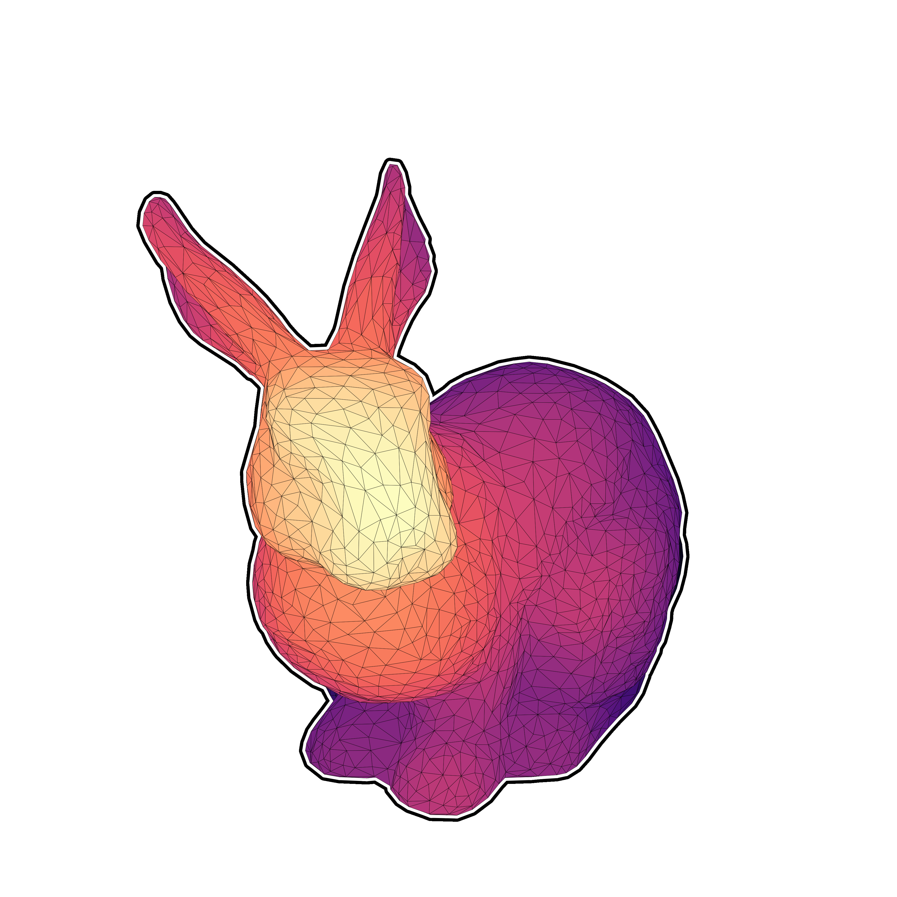
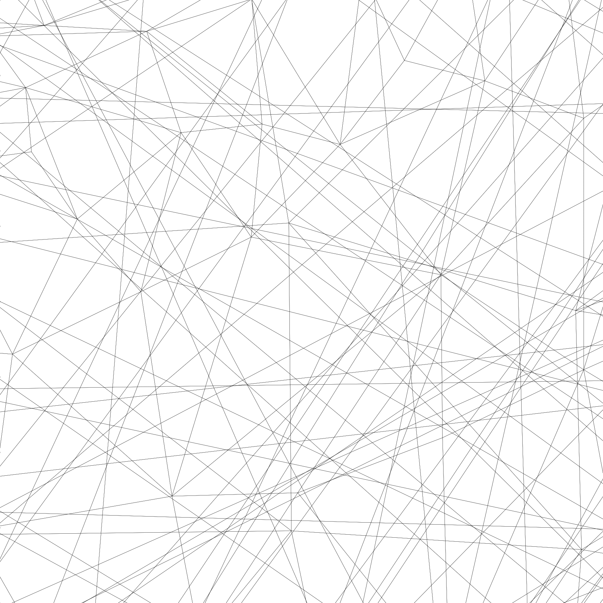
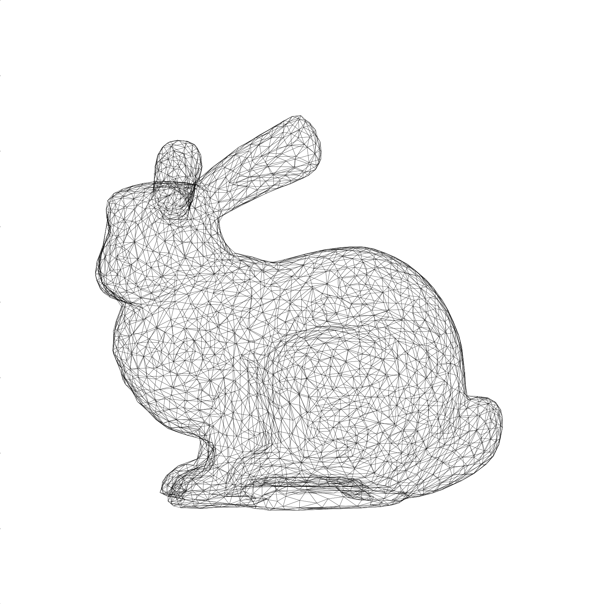
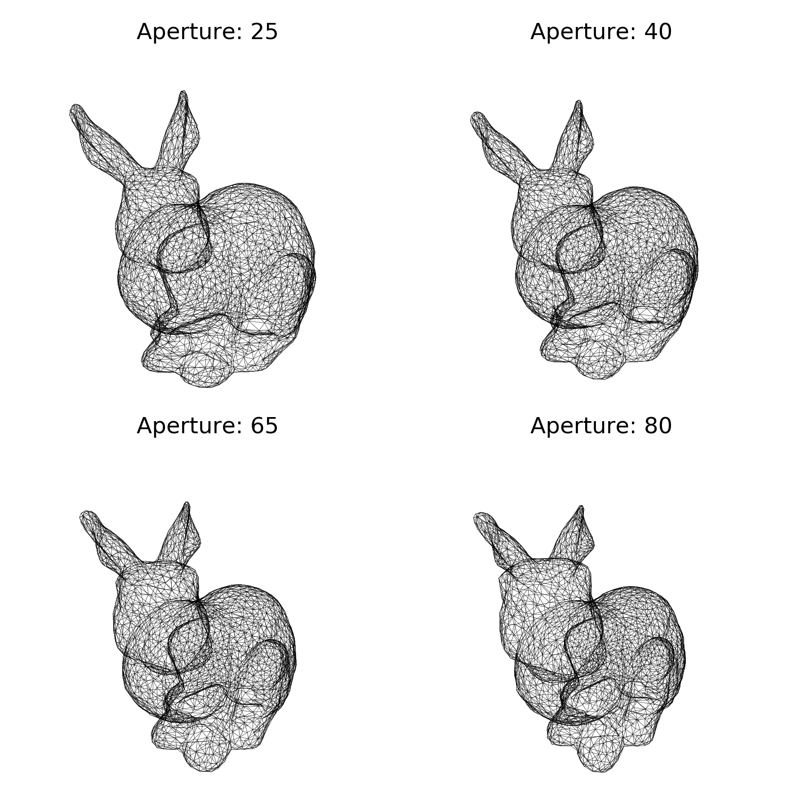
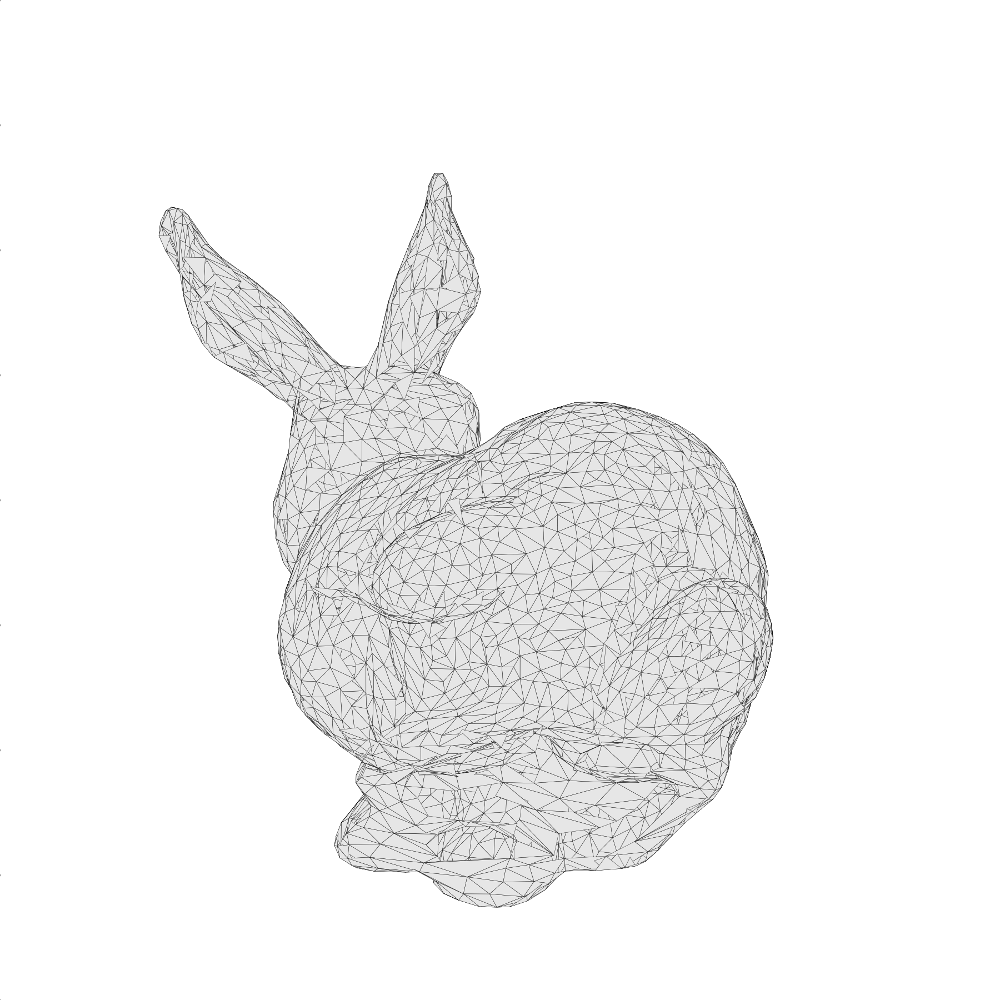
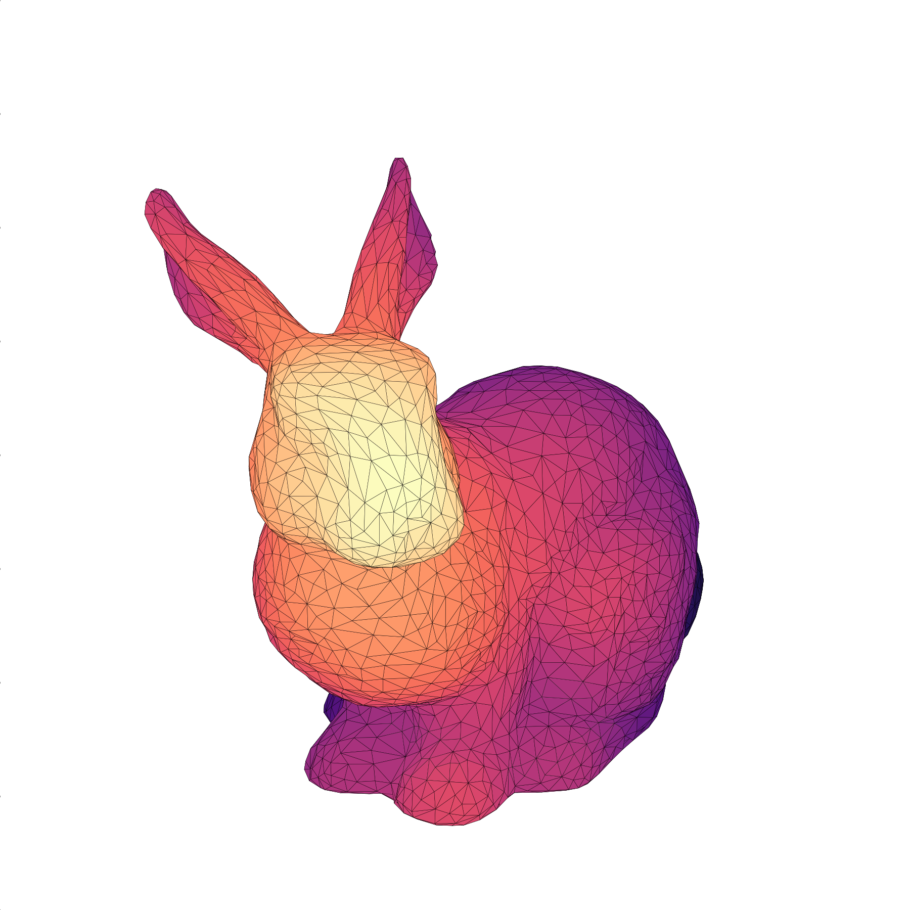
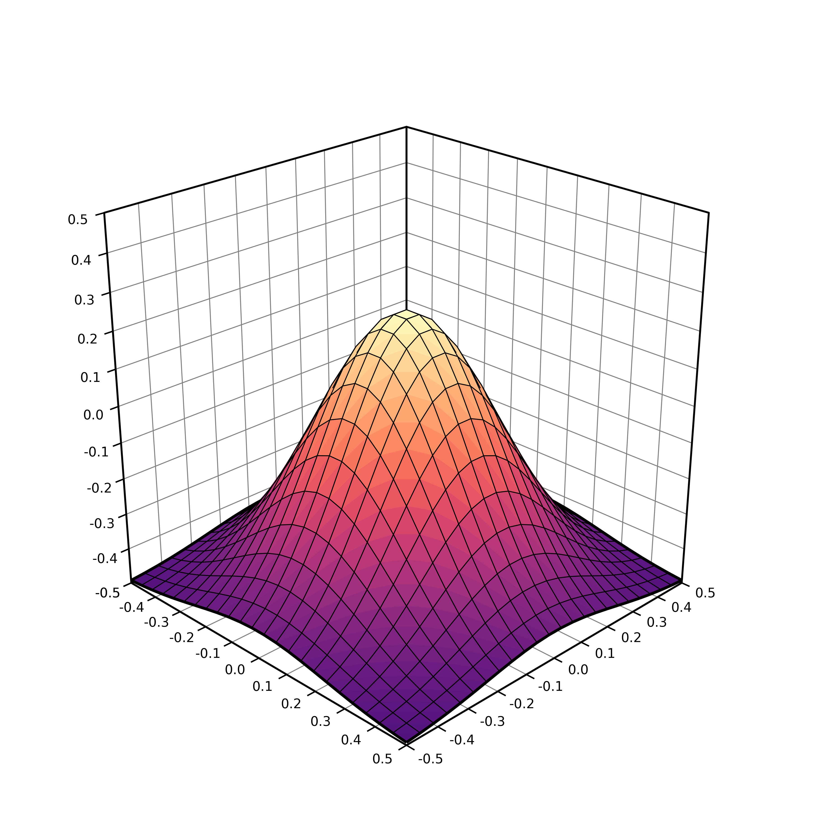
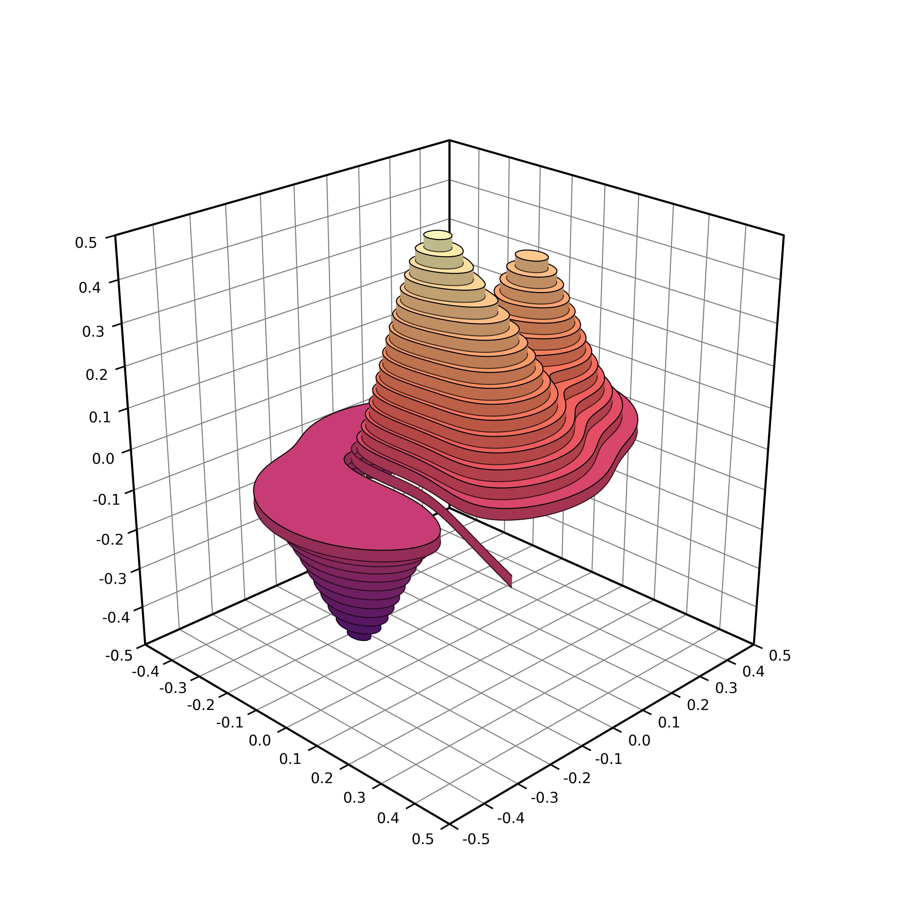

Matplotlib has a really nice [3D
interface](https://matplotlib.org/mpl_toolkits/mplot3d/tutorial.html) with many
capabilities (and some limitations) that is quite popular among users. Yet, 3D
is still considered to be some kind of black magick for some users (or maybe
for the majority of users). I would thus like to explain in this post that 3D
rendering is really easy once you've understood a few concepts. To demonstrate
that, we'll render the bunny above with 100 lines of Python and one matplotlib
call. That is, without using the 3D axis.

**Advertisement**: This post comes from an upcoming open access book on
  scientific visualization using Python and Matplotlib. If you want to
  support my work and have an early access to the book, go to
  https://github.com/rougier/scientific-visualization-book.


# Loading the bunny

First things first, we need to load our model. We'll use a [simplified
version](bunny.obj) of the [Stanford
bunny](https://en.wikipedia.org/wiki/Stanford_bunny). The file uses the
[wavefront format](https://en.wikipedia.org/wiki/Wavefront_.obj_file) which is
one of the simplest format, so let's make a very simple (but error-prone)
loader that will just do the job for this post (and this model):

```Python
V, F = [], []
with open("bunny.obj") as f:
   for line in f.readlines():
       if line.startswith('#'):
           continue
       values = line.split()
       if not values:
           continue
       if values[0] == 'v':
           V.append([float(x) for x in values[1:4]])
       elif values[0] == 'f':
           F.append([int(x) for x in values[1:4]])
V, F = np.array(V), np.array(F)-1
```

`V` is now a set of vertices (3D points if you prefer) and `F` is a set of
faces (= triangles). Each triangle is described by 3 indices relatively to the
vertices array. Now, let's normalize the vertices such that the overall bunny
fits the unit box:

```
V = (V-(V.max(0)+V.min(0))/2)/max(V.max(0)-V.min(0))
```

Now, we can have a first look at the model by getting only the x,y coordinates of the vertices and get rid of the z coordinate. To do this we can use the powerful
[PolyCollection](https://matplotlib.org/3.1.1/api/collections_api.html#matplotlib.collections.PolyCollection)
object that allow to render efficiently a collection of non-regular
polygons. Since, we want to render a bunch of triangles, this is a perfect
match. So let's first extract the triangles and get rid of the `z` coordinate:

```
T = V[F][...,:2]
```

And we can now render it:

```
fig = plt.figure(figsize=(6,6))
ax = fig.add_axes([0,0,1,1], xlim=[-1,+1], ylim=[-1,+1],
                  aspect=1, frameon=False)
collection = PolyCollection(T, closed=True, linewidth=0.1,
                            facecolor="None", edgecolor="black")
ax.add_collection(collection)
plt.show()
```

You should obtain something like this ([bunny-1.py](bunny-1.py)):


# Perspective Projection

The rendering we've just made is actually an [orthographic
projection](https://en.wikipedia.org/wiki/Orthographic_projection) while the
top bunny uses a [perspective projection](https://en.wikipedia.org/wiki/3D_projection#Perspective_projection):


In both cases, the proper way of defining a projection is first to define a
viewing volume, that is, the volume in the 3d space we want to render on the
scree. To do that, we need to consider 6 clipping planes (left, right, top,
bottom, far, near) that enclose the viewing volume (frustum) relatively to the
camera. If we define a camera position and a viewing direction, each plane can
be described by a single scalar. Once we have this viewing volume, we can
project onto the screen using either the orthographic or the perspective
projection.

Fortunately for us, these projections are quite well known and can be expressed
using 4x4 matrices:

```
def frustum(left, right, bottom, top, znear, zfar):
    M = np.zeros((4, 4), dtype=np.float32)
    M[0, 0] = +2.0 * znear / (right - left)
    M[1, 1] = +2.0 * znear / (top - bottom)
    M[2, 2] = -(zfar + znear) / (zfar - znear)
    M[0, 2] = (right + left) / (right - left)
    M[2, 1] = (top + bottom) / (top - bottom)
    M[2, 3] = -2.0 * znear * zfar / (zfar - znear)
    M[3, 2] = -1.0
    return M

def perspective(fovy, aspect, znear, zfar):
    h = np.tan(0.5*radians(fovy)) * znear
    w = h * aspect
    return frustum(-w, w, -h, h, znear, zfar)
```

For the perspective projection, we also need to specify the aperture angle that
(more or less) sets the size of the near plane relatively to the far
plane. Consequently, for high apertures, you'll get a lot of "deformations".

However, if you look at the two functions above, you'll realize they return 4x4
matrices while our coordinates are 3d. How to use these matrices then ? The
answer is [homogeneous
coordinates](https://en.wikipedia.org/wiki/Homogeneous_coordinates). To make
along story short, homogeneous coordinates are best to deal with transformation
and projections in 3D. In our case, because we're dealing with vertices (and
not vectors), we only need to add 1 as the fourth coordinates (w) to all our
vertices. Then we can apply the perspective transformation using the dot
product.

```
V = np.c_[V, np.ones(len(V))] @ perspective(25,1,1,100).T
```

Last step, we need to re-normalize the homogeneous coordinates. This means we
divide each transformed vertices with the last component (w) such as to always
have w=1 for each vertices.

```
V /= V[:,3].reshape(-1,1)
```

Now we can display the result again ([bunny-2.py](bunny-2.py)):



Oh, weird result. What's wrong? What is wrong is that the camera is actually
inside the bunny. To have a proper rendering, we need to move the bunny away
from the camera or move the camera away from the bunny. Let's do the later. The
camera is currently positioned at (0,0,0) and looking up in the z direction
(because of the frustum transformation). We thus need to move the camera away a
little bit in the z negative direction and **before the perspective
transformation**:

```
V = V - (0,0,3.5)
V = np.c_[V, np.ones(len(V))] @ perspective(25,1,1,100).T
V /= V[:,3].reshape(-1,1)
```

An now you should obtain ([bunny-3.py](bunny-3.py)):



# Model, view, projection (MVP)

It might be not obvious, but the last rendering is actually a perspective
transformation. To make it more obvious, we'll rotate the bunny around. To do
that, we need some rotation matrices (4x4) and we can as well define the
translation matrix in the meantime:

```
def translate(x, y, z):
    return np.array([[1, 0, 0, x],
                     [0, 1, 0, y],
                     [0, 0, 1, z],
                     [0, 0, 0, 1]], dtype=float)

def xrotate(theta):
    t = np.pi * theta / 180
    c, s = np.cos(t), np.sin(t)
    return np.array([[1, 0,  0, 0],
                     [0, c, -s, 0],
                     [0, s,  c, 0],
                     [0, 0,  0, 1]], dtype=float)

def yrotate(theta):
    t = np.pi * theta / 180
    c, s = np.cos(t), np.sin(t)
    return  np.array([[ c, 0, s, 0],
                      [ 0, 1, 0, 0],
                      [-s, 0, c, 0],
                      [ 0, 0, 0, 1]], dtype=float)
```

We'll now decompose the transformations we want to apply in term of model
(local transformations), view (global transformations) and projection such that
we can compute a global MVP matrix that will do everything at once:

```
model = xrotate(20) @ yrotate(45) 
view  = translate(0,0,-3.5)
proj  = perspective(25, 1, 1, 100) 
MVP   = proj  @ view  @ model 
```

and we now write:
```
V = np.c_[V, np.ones(len(V))] @ MVP.T
V /= V[:,3].reshape(-1,1)
```

You should obtain ([bunny-4.py](bunny-4.py)):


Let's now play a bit with the aperture such that you can see the difference.
Note that we also have to adapt the distance to the camera in order for the bunnies to have the same apparent size ([bunny-5.py](bunny-5.py)):




# Depth sorting

Let's try now to fill the triangles ([bunny-6.py](bunny-6.py)):



As you can see, the result is "interesting" and totally wrong. The problem is
that the PolyCollection will draw the triangle in the order they are given
while we would like to have them from back to front. This means we need to sort
them according to their depth. The good news is that we already computed this
information when we applied the MVP transformation. It is stored in the new z
coordinates. However, these z values are vertices based while we need to store
triangles. We'll thus take the mean "z" value as being representative of the
depth of a triangle. If triangles are relatively small and do not intersect,
this will work beautifully:

```
T =  V[:,:,:2]
Z = -V[:,:,2].mean(axis=1)
I = np.argsort(Z)
T = T[I,:]
```

And now everything is rendered right ([bunny-7.py](bunny-7.py)):


Let's add some colors using the depth buffer. We'll color each triangle
according to it depth. The beauty of the PolyCollection object is that you can
specify the color of each of the triangle using a numpy array, so let's just do
that:

```
zmin, zmax = Z.min(), Z.max()
Z = (Z-zmin)/(zmax-zmin)
C = plt.get_cmap("magma")(Z)
I = np.argsort(Z)
T, C = T[I,:], C[I,:]
```

And now everything is rendered right ([bunny-8.py](bunny-8.py)):




So, the final script is 77 lines (with empty lines):

```
import numpy as np
import matplotlib.pyplot as plt
from matplotlib.collections import PolyCollection

def frustum(left, right, bottom, top, znear, zfar):
    M = np.zeros((4, 4), dtype=np.float32)
    M[0, 0] = +2.0 * znear / (right - left)
    M[1, 1] = +2.0 * znear / (top - bottom)
    M[2, 2] = -(zfar + znear) / (zfar - znear)
    M[0, 2] = (right + left) / (right - left)
    M[2, 1] = (top + bottom) / (top - bottom)
    M[2, 3] = -2.0 * znear * zfar / (zfar - znear)
    M[3, 2] = -1.0
    return M

def perspective(fovy, aspect, znear, zfar):
    h = np.tan(0.5*np.radians(fovy)) * znear
    w = h * aspect
    return frustum(-w, w, -h, h, znear, zfar)
def translate(x, y, z):
    return np.array([[1, 0, 0, x],
                     [0, 1, 0, y],
                     [0, 0, 1, z],
                     [0, 0, 0, 1]], dtype=float)

def xrotate(theta):
    t = np.pi * theta / 180
    c, s = np.cos(t), np.sin(t)
    return np.array([[1, 0,  0, 0],
                     [0, c, -s, 0],
                     [0, s,  c, 0],
                     [0, 0,  0, 1]], dtype=float)

def yrotate(theta):
    t = np.pi * theta / 180
    c, s = np.cos(t), np.sin(t)
    return  np.array([[ c, 0, s, 0],
                      [ 0, 1, 0, 0],
                      [-s, 0, c, 0],
                      [ 0, 0, 0, 1]], dtype=float)

V, F = [], []
with open("bunny.obj") as f:
    for line in f.readlines():
        if line.startswith('#'):
            continue
        values = line.split()
        if not values:
            continue
        if values[0] == 'v':
            V.append([float(x) for x in values[1:4]])
        elif values[0] == 'f' :
            F.append([int(x) for x in values[1:4]])
V, F = np.array(V), np.array(F)-1
V = (V-(V.max(0)+V.min(0))/2) / max(V.max(0)-V.min(0))

model = xrotate(20) @ yrotate(45) 
view  = translate(0,0,-3.5)
proj  = perspective(25, 1, 1, 100) 
MVP   = proj @ view @ model 

V = np.c_[V, np.ones(len(V))]  @ MVP.T
V /= V[:,3].reshape(-1,1)
V = V[F]
T =  V[:,:,:2]
Z = -V[:,:,2].mean(axis=1)
zmin, zmax = Z.min(), Z.max()
Z = (Z-zmin)/(zmax-zmin)
C = plt.get_cmap("magma")(Z)
I = np.argsort(Z)
T, C = T[I,:], C[I,:]

fig = plt.figure(figsize=(6,6))
ax = fig.add_axes([0,0,1,1], xlim=[-1,+1], ylim=[-1,+1], aspect=1, frameon=False)
collection = PolyCollection(T, closed=True, linewidth=0.1,
                            facecolor=C, edgecolor="black")
ax.add_collection(collection)
plt.show()
```


Now it's your turn to play. Starting from this simple script, you can achieve
interesting results:





