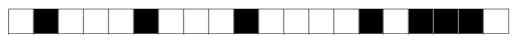
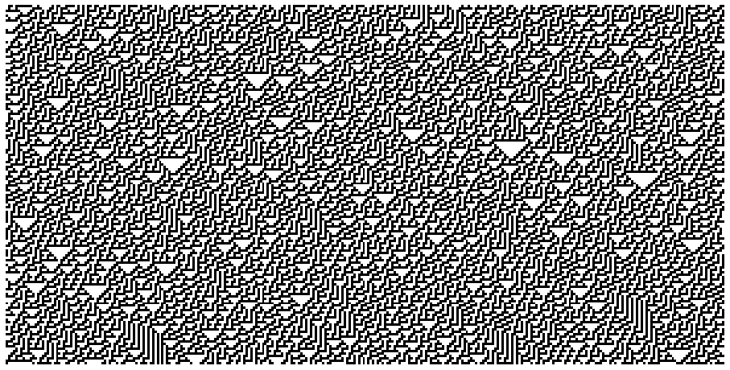
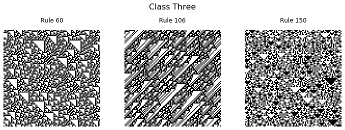
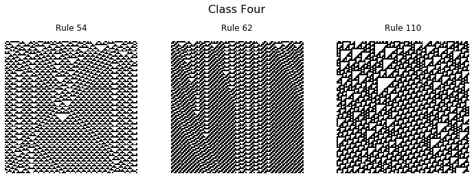

[Cellular automata](https://en.wikipedia.org/wiki/Cellular_automaton) are discrete models, typically on a grid, which evolve in time. Each grid cell has a finite state, such as 0 or 1, which is updated based on a certain set of rules. A specific cell uses information of the surrounding cells, called it's _neighborhood_, to determine what changes should be made. In general cellular automata can be defined in any number of dimensions. A famous two dimensional example is [Conway's Game of Life](https://en.wikipedia.org/wiki/Conway%27s_Game_of_Life) in which cells "live" and "die", sometimes producing beautiful patterns. 


In this post we will be looking at a one dimensional example known as [elementary cellular automaton](https://en.wikipedia.org/wiki/Elementary_cellular_automaton), popularized by [Stephen Wolfram](https://en.wikipedia.org/wiki/Stephen_Wolfram) in the 1980s.



Imagine a row of cells, arranged side by side, each of which is colored black or white. We label black cells 1 and white cells 0, resulting in an array of bits. As an example lets consider a random array of 20 bits. 


```python
import numpy as np

rng = np.random.RandomState(42)
data = rng.randint(0, 2, 20)

print(data)
```

    [0 1 0 0 0 1 0 0 0 1 0 0 0 0 1 0 1 1 1 0]


To update the state of our cellular automaton we will need to define a set of rules. 
A given cell \\(C\\) only knows about the state of it's left and right neighbors, labeled \\(L\\) and \\(R\\) respectively. We can define a function or rule, \\(f(L, C, R)\\), which maps the cell state to either 0 or 1.

Since our input cells are binary values there are \\(2^3=8\\) possible inputs into the function. 


```python
for i in range(8):
    print(np.binary_repr(i, 3))
```

    000
    001
    010
    011
    100
    101
    110
    111


For each input triplet, we can assign 0 or 1 to the output. The output of \\(f\\) is the value which will replace the current cell \\(C\\) in the next time step. In total there are \\(2^{2^3} = 2^8 = 256\\) possible rules for updating a cell. Stephen Wolfram introduced a naming convention, now known as the [Wolfram Code](https://en.wikipedia.org/wiki/Wolfram_code), for the update rules in which each rule is represented by an 8 bit binary number. 

For example "Rule 30" could be constructed by first converting to binary and then building an array for each bit


```python
rule_number = 30
rule_string = np.binary_repr(rule_number, 8)
rule = np.array([int(bit) for bit in rule_string])
print(rule)
```

    [0 0 0 1 1 1 1 0]


By convention the Wolfram code associates the leading bit with '111' and the final bit with '000'. For rule 30 the relationship between the input, rule index and output is as follows:


```python
for i in range(8):
    triplet = np.binary_repr(i, 3)
    print(f"input:{triplet}, index:{7-i}, output {rule[7-i]}")
```

    input:000, index:7, output 0
    input:001, index:6, output 1
    input:010, index:5, output 1
    input:011, index:4, output 1
    input:100, index:3, output 1
    input:101, index:2, output 0
    input:110, index:1, output 0
    input:111, index:0, output 0


We can define a function which maps the input cell information with the associated rule index. Essentially we are converting the binary input to decimal and adjusting the index range. 


```python
def rule_index(triplet):
    L, C, R = triplet
    index = 7 - (4*L + 2*C + R)
    return int(index)
```

Now we can take in any input and look up the output based on our rule, for example:


```python
rule[rule_index((1, 0, 1))]
```


    0


Finally, we can use Numpy to create a data structure containing all the triplets for our state array and apply the function across the appropriate axis to determine  our new state.


```python
all_triplets = np.stack([
    np.roll(data, 1), 
    data, 
    np.roll(data, -1)]
)
new_data = rule[np.apply_along_axis(rule_index, 0, all_triplets)]
print(new_data)
```

    [1 1 1 0 1 1 1 0 1 1 1 0 0 1 1 0 1 0 0 1]


That is the process for a single update of our cellular automata. 

To do many updates and record the state over time, we will create a function.


```python
def CA_run(initial_state, n_steps, rule_number):
    rule_string = np.binary_repr(rule_number, 8)
    rule = np.array([int(bit) for bit in rule_string])

    m_cells = len(initial_state)
    CA_run = np.zeros((n_steps, m_cells))
    CA_run[0, :] = initial_state

    for step in range(1, n_steps):
        all_triplets = np.stack(
            [
                np.roll(CA_run[step - 1, :], 1),
                CA_run[step - 1, :],
                np.roll(CA_run[step - 1, :], -1),
            ]
        )
        CA_run[step, :] = rule[np.apply_along_axis(rule_index, 0, all_triplets)]

    return CA_run
```


```python
initial = np.array([0, 1, 0, 0, 0, 1, 0, 0, 0, 1, 0, 0, 0, 0, 1, 0, 1, 1, 1, 0])
data = CA_run(initial, 10, 30)
print(data)
```

    [[0. 1. 0. 0. 0. 1. 0. 0. 0. 1. 0. 0. 0. 0. 1. 0. 1. 1. 1. 0.]
     [1. 1. 1. 0. 1. 1. 1. 0. 1. 1. 1. 0. 0. 1. 1. 0. 1. 0. 0. 1.]
     [0. 0. 0. 0. 1. 0. 0. 0. 1. 0. 0. 1. 1. 1. 0. 0. 1. 1. 1. 1.]
     [1. 0. 0. 1. 1. 1. 0. 1. 1. 1. 1. 1. 0. 0. 1. 1. 1. 0. 0. 0.]
     [1. 1. 1. 1. 0. 0. 0. 1. 0. 0. 0. 0. 1. 1. 1. 0. 0. 1. 0. 1.]
     [0. 0. 0. 0. 1. 0. 1. 1. 1. 0. 0. 1. 1. 0. 0. 1. 1. 1. 0. 1.]
     [1. 0. 0. 1. 1. 0. 1. 0. 0. 1. 1. 1. 0. 1. 1. 1. 0. 0. 0. 1.]
     [0. 1. 1. 1. 0. 0. 1. 1. 1. 1. 0. 0. 0. 1. 0. 0. 1. 0. 1. 1.]
     [0. 1. 0. 0. 1. 1. 1. 0. 0. 0. 1. 0. 1. 1. 1. 1. 1. 0. 1. 0.]
     [1. 1. 1. 1. 1. 0. 0. 1. 0. 1. 1. 0. 1. 0. 0. 0. 0. 0. 1. 1.]]


## Let's Get Visual

For larger simulations, interesting patterns start to emerge. To visualize our simulation results we will use the `ax.matshow` function.


```python
import matplotlib.pyplot as plt
plt.rcParams['image.cmap'] = 'binary'

rng = np.random.RandomState(0)
data = CA_run(rng.randint(0, 2, 300), 150, 30)

fig, ax = plt.subplots(figsize=(16, 9))
ax.matshow(data)
ax.axis(False);
```





## Learning the Rules

With the code set up to produce the simulation, we can now start to explore the properties of these different rules. Wolfram separated the rules into four classes which are outlined below.


```python
def plot_CA_class(rule_list, class_label):
    rng = np.random.RandomState(seed=0)
    fig, axs = plt.subplots(1, len(rule_list),figsize=(10, 3.5), constrained_layout=True)
    initial = rng.randint(0, 2, 100)

    for i, ax in enumerate(axs.ravel()):
        data = CA_run(initial, 100, rule_list[i])
        ax.set_title(f'Rule {rule_list[i]}')
        ax.matshow(data)
        ax.axis(False)
        
    fig.suptitle(class_label, fontsize=16)
    
    return fig, ax
```

### Class One
Cellular automata which rapidly converge to a uniform state


```python
_ = plot_CA_class([4, 32, 172], 'Class One')
```


### Class Two
Cellular automata which rapidly converge to a repetitive or stable state


```python
_ = plot_CA_class([50, 108, 173], 'Class Two')
```


### Class Three

Cellular automata which appear to remain in a random state


```python
_ = plot_CA_class([60, 106, 150], 'Class Three')
```





### Class Four

Cellular automata which form areas of repetitive or stable states, but also form structures that interact with each other in complicated ways.


```python
_ = plot_CA_class([54, 62, 110], 'Class Four')
```





Amazingly, the interacting structures which emerge from rule 110 has been shown to be capable of [universal computation](https://en.wikipedia.org/wiki/Turing_machine).

In all the examples above a random initial state was used, but another interesting case is when a single 1 is initialized with all other values set to zero. 


```python
initial = np.zeros(300)
initial[300//2] = 1
data = CA_run(initial, 150, 30)

fig, ax = plt.subplots(figsize=(10, 5))
ax.matshow(data)
ax.axis(False);
```


For certain rules, the emergent structures interact in chaotic and interesting ways. 

I hope you enjoyed this brief look into the world of elementary cellular automata, and are inspired to make some pretty pictures of your own.
