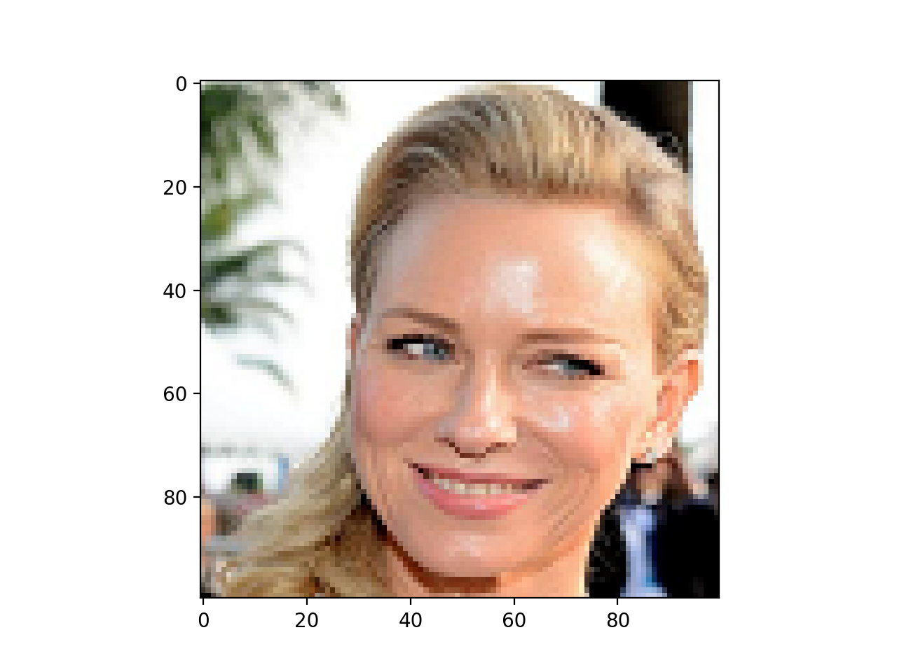
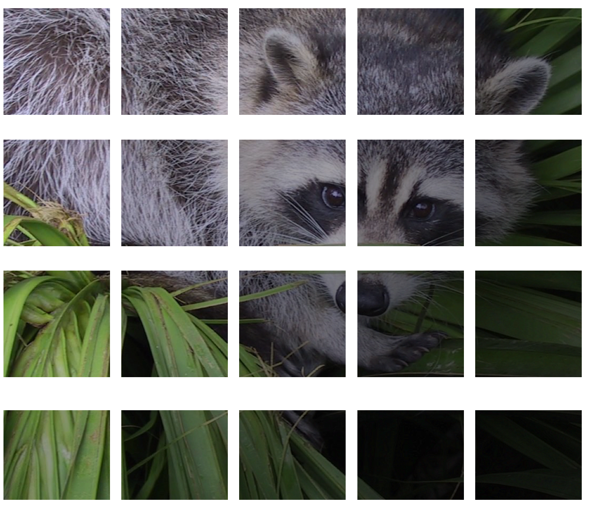
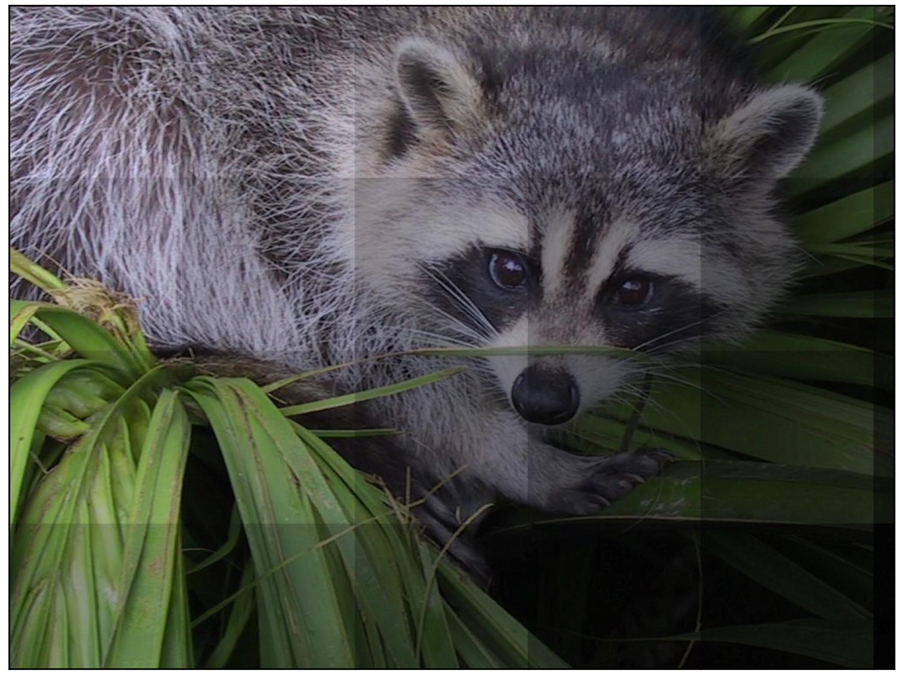
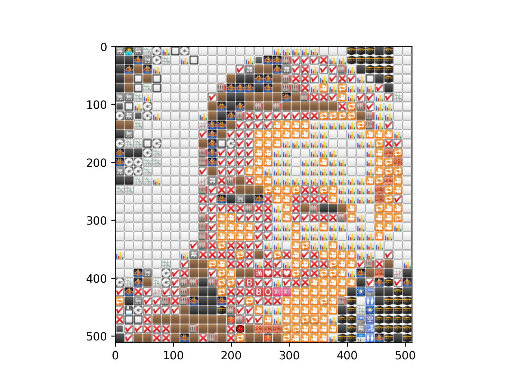
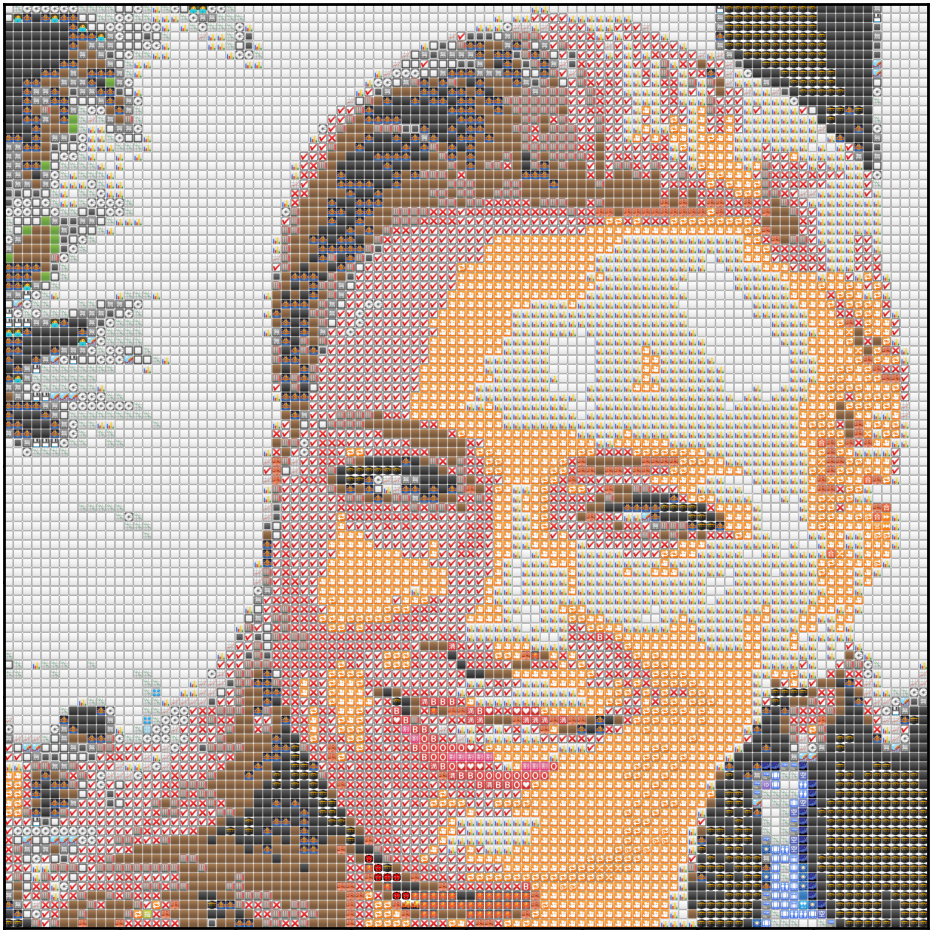
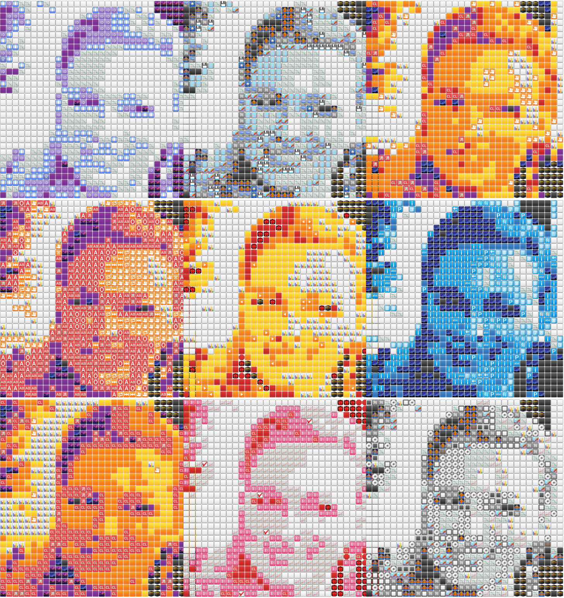

A while back, I came across this cool [repository](https://github.com/willdady/emosaic) to create emoji-art from images. I wanted to use it to transform my mundane Facebook profile picture to something more snazzy. The only trouble? It was written in Rust. 

So instead of going through the process of installing Rust, I decided to take the easy route and spin up some code to do the same in Python using matplotlib.

~~Because that's what anyone sane would do, right??~~

In this post, I'll try to explain my process as we attempt to recreate similar mosaics as this one below. I've aimed this post at people who've worked with _some_ sort of image data before; but really, anyone can follow along.  


## Packages

```python
import numpy as np 
from tqdm import tqdm
from scipy import spatial
from matplotlib import cm
import matplotlib.pyplot as plt
import matplotlib
import scipy


print(f"Matplotlib:{matplotlib.__version__}")
print(f"Numpy:{np.__version__}")
print(f"Scipy: {scipy.__version__}")

## Matplotlib: '3.2.1'
## Numpy: '1.18.1'
## Scipy: '1.4.1'
```

Let's read in our image - 

```
img = plt.imread(r"naomi_32.png", 1)
dim = img.shape[0] ##we'll need this later
plt.imshow(img)
```



**Note**: *The image displayed above is 100x100 but we'll use a 32x32 from here on since that's gonna suffice all our needs.* 

So really, what _is_ an image? To numpy and matplotlib (and for almost every image processing library out there), it is, essentially, just a matrix (say A), where every individual pixel (p) is an element of A. If it's a grayscale image, every pixel (p) is just a single number (or a scalar) - in the range [0,1] if float, or [0,255] if integer. If it's not grayscale - like in our case - every pixel is a vector of either dimension 3 - **Red**(R), **Green**(G), and **Blue**(B), or dimension 4 - RGBA(A stands for **Alpha** which is basically transparency). 

If anything is unclear so far, I'd strongly suggest going through a post like [this](https://matplotlib.org/3.1.1/tutorials/introductory/images.html) or [this](http://scipy-lectures.org/advanced/image_processing/). Knowing that an image can be represented as a matrix (or a `numpy array`) greatly helps us as almost every transformation of the image can be represented in terms of matrix maths.

To prove my point, let's look at `img` a little.

```python

## Let's check the type of img
print(type(img))
# <class 'numpy.ndarray'>

## The shape of the array img
print(img.shape)
# (32, 32, 4)

## The value of the first pixel of img
print(img[0][0])
# [128 144 117 255]

## Let's view the color of the first pixel
fig, ax = plt.subplots()
color=img[0][0]/255.0 ##RGBA only accepts values in the 0-1 range
ax.fill([0, 1, 1, 0], [0, 0, 1, 1], color=color)
```
That should give you a square filled with the color of the first pixel of `img`. 

![img[0][0]](./first_pixel.png "The first pixel of the image we read in")


## Methodology

We want to go from a plain image to an image full of emojis - or in other words, __an image of images__. Essentially, we're going to replace all pixels with emojis. However, to ensure that our new emoji-image looks like the original image and not just random smiley faces, the trick is to make sure that *every pixel is replaced my an emoji which has similar color to that pixel*. That's what gives the result the look of a mosaic.

'Similar' really just means that the __mean__ (median is also worth trying) color of the emoji should be close to the pixel it replaces. 

So how do you find the mean color of an entire image? Easy. We just take all the RGBA arrays and average the Rs together, and then the Gs together, and then the Bs together, and then the As together (the As, by the way, are just all 1 in our case, so the mean is also going to be 1). Here's that idea expressed formally -

\\[ (r, g, b){\mu}=\left(\frac{\left(r{1}+r_{2}+\ldots+r_{N}\right)}{N}, \frac{\left(g_{1}+g_{2}+\ldots+g_{N}\right)}{N}, \frac{\left(b_{1}+b_{2}+\ldots+b_{N}\right)}{N}\right) \\]


The resulting color would be single array of RGBA values - \\[ [r_{\mu},  g_{\mu},  b_{\mu}, 1] \\]

So now our steps become somewhat like this -

**Part I** - Get emoji matches

1. Find a bunch of emojis.
2. Find the mean of the emojis. 
3. Select first pixel, find the emoji closest to it (wrt color), and replace pixel with that emoji (say, E). 
4. Repeat #3 for all pixels in the image. 


**Part II** - Reshape emojis to image

1. Reshape the flattened array of all Es back to the shape of our image.
2. Concatenate all emojis into a single array (reduce dimensions).


That's pretty much it!

### Step I1 - Our Emoji bank

I took care of this for you beforehand with a bit of BeautifulSoup and requests magic. Our emoji collection is a numpy array of shape `1506, 16, 16, 4` - that's 1506 emojis with each being a 16x16 array of RGBA values. You can find it [here](https://github.com/sharmaabhishekk/emoji-mosaic-mpl).

```python
emoji_array = np.load("emojis_16.npy")
print(emoji_array.shape)
## 1506, 16, 16, 4

##plt.imshow(emoji_array[0]) ##to view the first emoji
```

### Step I2 - Calculate the mean RGBA value of all emojis.

We've seen the formula above; here's the numpy code for it. We're gonna iterate over all all the 1506 emojis and create an array `emoji_mean_array` out of them.

```python
emoji_mean_array = np.array([ar.mean(axis=(0,1)) for ar in emoji_array]) ##`np.median(ar, axis=(0,1))` for median instead of mean
```

### Step I3 and I4 - finding closest emoji match for all pixels

The easiest way to do that would be use Scipy's **`KDTree`** to create a `tree` object of all average RGBA values we calculated in #2. This enables us to perform fast lookup for every pixel using the `query` method. Here's how the code for that looks - 

```python

tree = spatial.KDTree(emoji_mean_array) 

indices = []
flattened_img = img.reshape(-1, img.shape[-1]) ##shape = [1024, 16, 16, 4]
for pixel in tqdm(flattened_img, desc="Matching emojis"):
    _, index=tree.query(pixel) ##returns distance and index of closest match.
    indices.append(index)
    
emoji_matches = emoji_array[indices] ##our emoji_matches
```
### Step II-1
The final step is to reshape the array a little more to enable us to plot it using the imshow function. As you can see above, to loop over the pixels we had to flatten the image out into the `flattened_img`. Now we have to sort of un-flatten it back; to make sure it's back in the form of an image. Fortunately, using numpy's `reshape` function makes this easy. 

```python
resized_ar = emoji_matches.reshape((dim, dim, 16, 16, 4)) ##dim is what we got earlier when we read in the image
```
### Step II-2
The last bit is the trickiest. The problem with the output we've got so far is that it's too nested. Or in simpler terms, what we have is a image where every individual pixel is itself an image. That's all fine but it's not valid input for imshow and if we try to pass it in, it tells us exactly that. 

```python
TypeError: Invalid shape (32, 32, 16, 16, 4) for image data
```
To grasp our problem intuitively, think about it this way. What we have right now are lots of images like these - 



What we want is to merge them all together. Like so -



To think about it slightly more technically, what we have right now is a *five* dimensional array. What we need is to rehshape it in such a way that it's - at maximum - *three* dimensional. However, it's not as easy as a simple `np.reshape` (I'd suggest you go ahead and try that anyway). 

Don't worry though, we have Stack Overflow to the rescue! This excellent [answer](https://stackoverflow.com/questions/52730668/concatenating-multiple-images-into-one/52733370#52733370) does exactly that. You don't have to go through it, I have copied the relevant code in here. 

```python
def np_block_2D(chops):
    """ Converts list of chopped images to one single image"""
    return np.block([[[x] for x in row] for row in chops])

final_img = np_block_2D(resized_ar)

print(final_img.shape)
## (512, 512, 4)
```
The shape looks correct enough. Let's try to plot it.

```python
plt.imshow(final_img)
```


**Et Voilà**

Of course, the result looks a little *meh* but that's because we only used 32x32 emojis. Here's what the same code would do with 10000 emojis (100x100).



Better? 

Now, let's try and create nine of these emoji-images and grid them together.

```python
def canvas(gray_scale_img):
    """ 
    Plot a 3x3 matrix of the images using different colormaps
        param gray_scale_img: a square gray_scale_image
    """
    fig, axes = plt.subplots(nrows=3, ncols=3, figsize=(13, 8))
    axes = axes.flatten()

    cmaps = ["BuPu_r", "bone", "CMRmap", "magma", "afmhot", "ocean", "inferno", "PuRd_r", "gist_gray"]
    for cmap, ax in zip(cmaps, axes):
        cmapper = cm.get_cmap(cmap)
        rgba_image = cmapper(gray_scale_img)
        single_plot(rgba_image, ax)
        #ax.imshow(rgba_image) ##try this if you just want to plot the plain image in different color spaces, comment the single_plot call above
        ax.set_axis_off()
    
    plt.subplots_adjust(hspace=0.0, wspace=-0.2)
    return fig, axes
```
The code does mostly the same stuff as before. To get the different colours, I used a simple hack. I first converted the image to grayscale and then used 9 different colormaps on it. Then I used the RGB values returned by the colormap to get the absolute values for our new input image. After that, the only part left is to just feed the new input image through the pipeline we've discussed so far and that gives us our emoji-image. 

Here's what that looks like - 



*Pretty*

## Conclusion

Some final thoughts to wrap this up. 

+ I'm not sure if my way to get different colours using different cmaps is what people usually do. I'm almost certain there's a better way and if you know one, please submit a PR to the repo (link below). 

+ Iterating over every pixel is not really the best idea. We got away with it since it's just 1024 (32x32) pixels but for images with higher resolution, we'd have to either iterate over grids of images at once (say a 3x3 or 2x2 window) or resize the image itself to a more workable shape. I prefer the latter since that way we can also just resize it to a square shape in the same call which also has the additional advantage of fitting in nicely in our 3x3 mosaic. I'll leave the reader to work that out themselves using numpy(and no, please don't use `cv2.resize`).

+ The `KDTree` was not part of my initial code. Initially, I'd just looped over every emoji for every pixel and then calculated the Euclidean distance (using `np.linalg.norm(a-b)`). As you can probably imagine, the nested loop in there slowed down the code tremendously - even a 32x32 emoji-image took around 10 minutes to run - right now the same code takes ~19 seconds. Guess that's the power of vectorization for you all.

+ It's worth messing around with median instead of mean to get the RGBA values of the emojis. Most emojis are circular in shape and hence there's a lot of space left outside the area of the circular region which sort of waters down the average color in turn watering down the end result. Considering the median might sort out this problem for some images which aren't very rich. 

+ While I've tried to go in a linear manner with (what I hope was) a good mix of explanation and code, I'd strongly suggest looking at the full code in the repository [here](https://github.com/sharmaabhishekk/emoji-mosaic-mpl) in case you feel like I sprung anything on you. 

------

I hope you enjoyed this post and learned something from it. If you have any feedback, criticism, questions, please feel free to DM me on [twitter](https://twitter.com/abhisheksh_98) or email me (preferably the former since I'm almost always on there). Thank you, and take care!