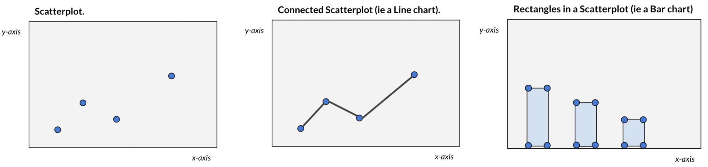
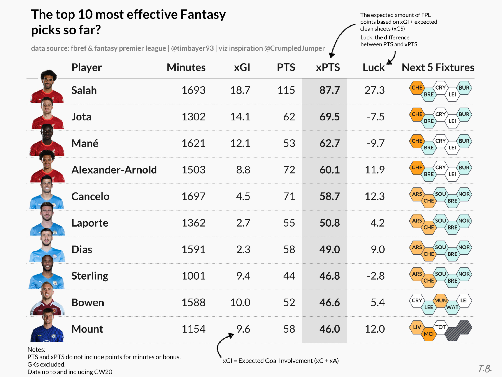
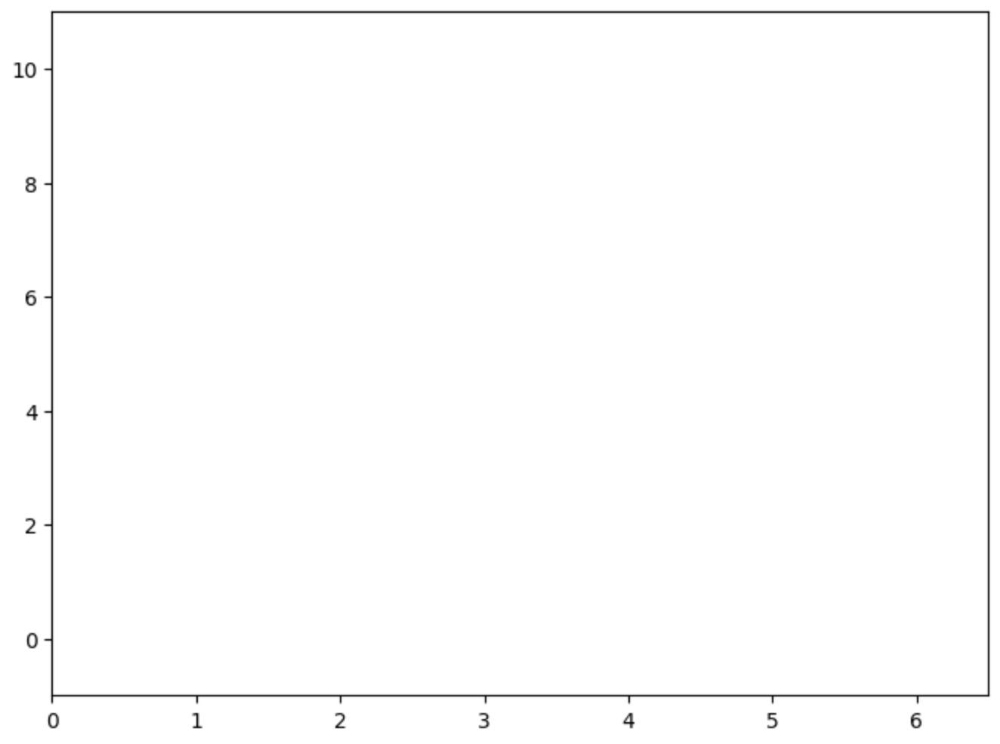
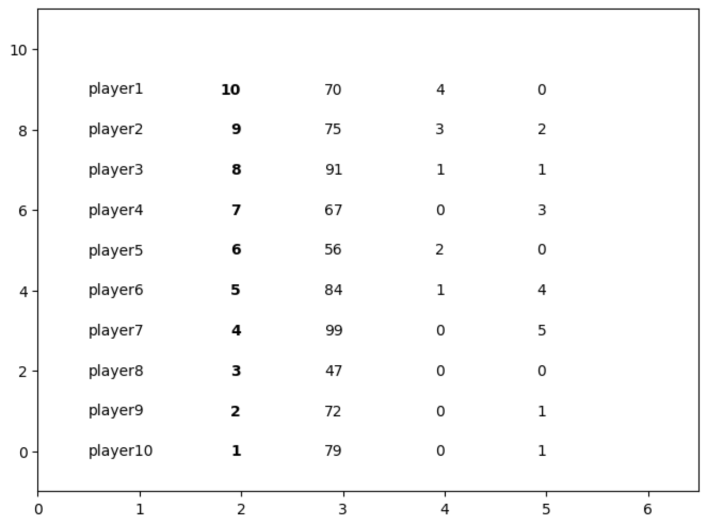
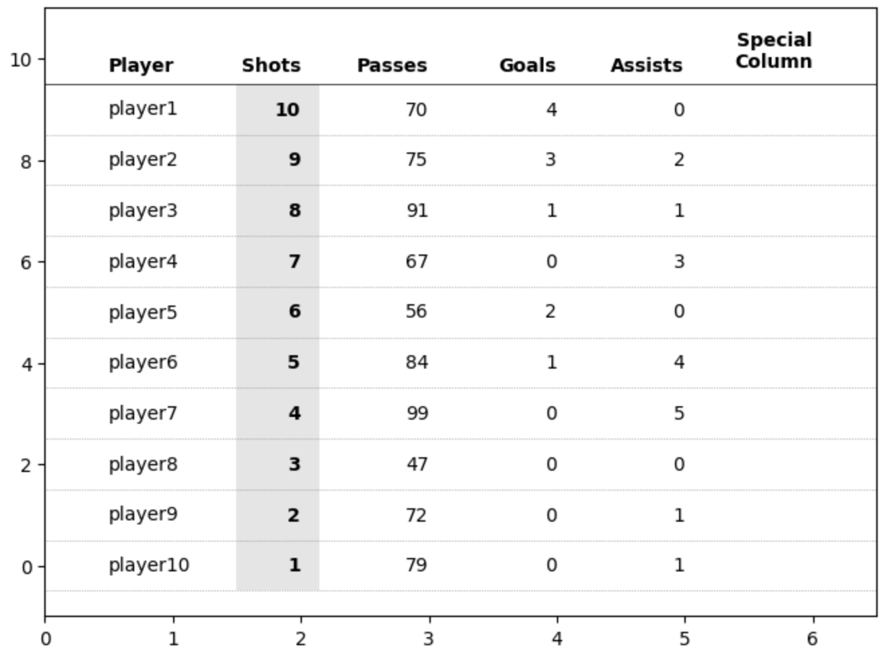
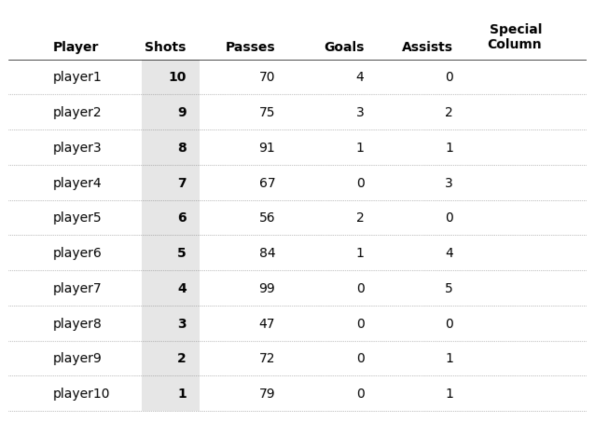
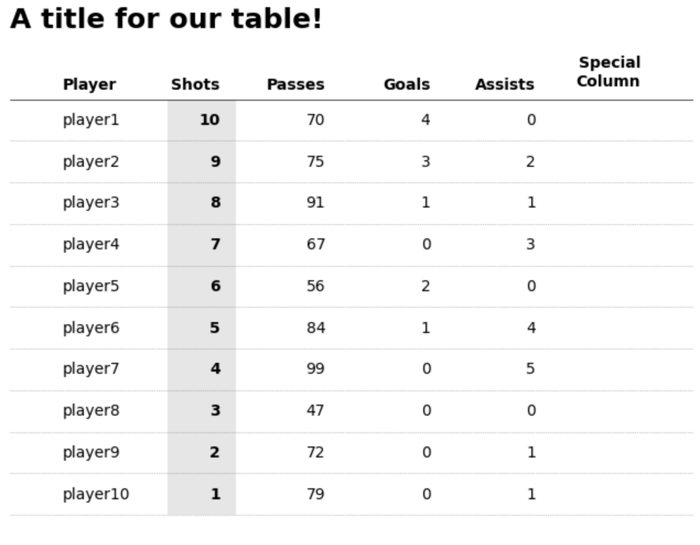
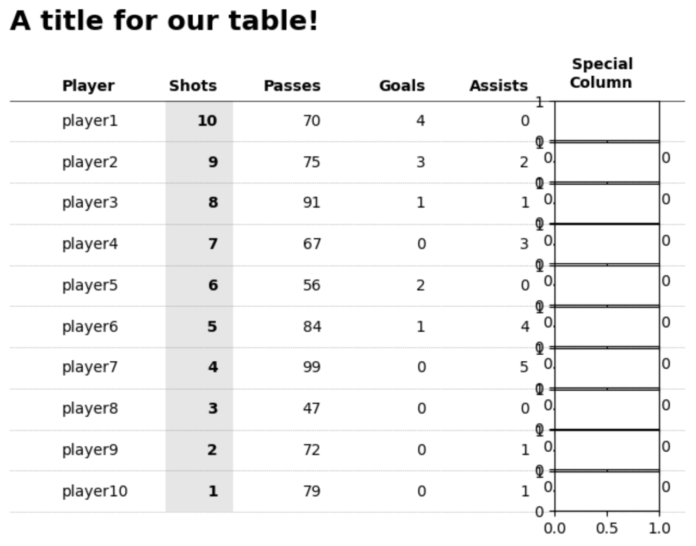
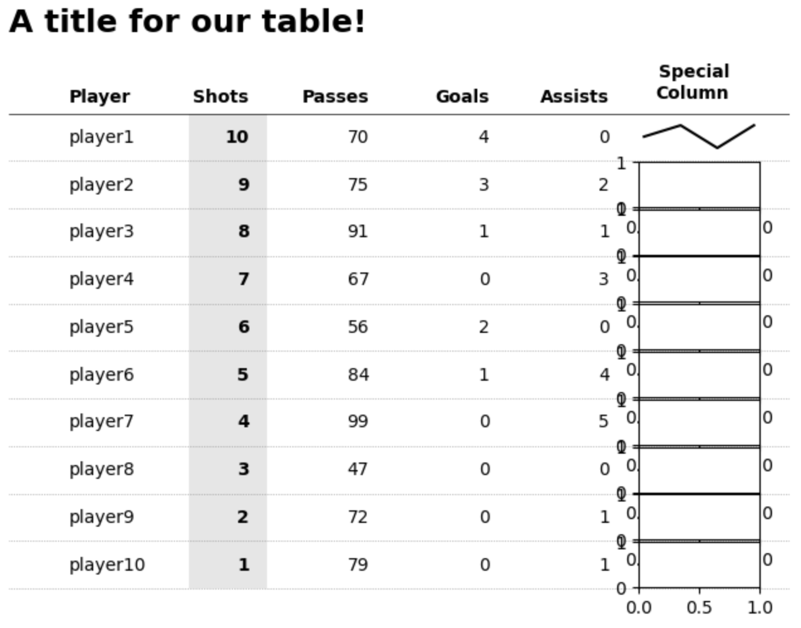

# Introduction

This tutorial will teach you how to create custom tables in Matplotlib, which are extremely flexible in terms of the design and layout. You’ll hopefully see that the code is very straightforward! In fact, the main methods we will be using are `ax.text()` and `ax.plot()`.

I want to give a lot of credit to [Todd Whitehead](https://twitter.com/CrumpledJumper) who has created these types of tables for various Basketball teams and players. His approach to tables is nothing short of fantastic due to the simplicity in design and how he manages to effectively communicate data to his audience. I was very much inspired by his approach and wanted to be able to achieve something similar in Matplotlib.

Before I begin with the tutorial, I wanted to go through the logic behind my approach as I think it's valuable and transferable to other  visualizations (and tools!).

With that, I would like you to **think of tables as highly structured and organized scatterplots**. Let me explain why: for me, scatterplots are the most fundamental chart type (regardless of tool).



For example `ax.plot()` automatically "connects the dots" to form a line chart or `ax.bar()` automatically "draws rectangles" across a set of coordinates. Very often (again regardless of tool) we may not always see this process happening. The point is, it is useful to think of any chart as a scatterplot or simply as a collection of shapes based on xy coordinates. This logic / thought process can unlock a ton of *custom* charts as the only thing you need are the coordinates (which can be mathematically computed).

With that in mind, we can move on to tables! So rather than plotting rectangles or circles we want to plot text and gridlines in a highly organized manner.

We will aim to create a table like this, which I have posted on Twitter [here](https://twitter.com/TimBayer93/status/1476926897850359809). Note, the only elements added outside of Matplotlib are the fancy arrows and their descriptions.




# Creating a custom table

Importing required libraries.

```python
import matplotlib as mpl
import matplotlib.patches as patches
from matplotlib import pyplot as plt
```

First, we will need to set up a coordinate space - I like two approaches: 
1. working with the standard Matplotlib 0-1 scale (on both the x- and y-axis) or 
2. an index system based on row / column numbers (this is what I will use here)

I want to create a coordinate space for a table containing 6 columns and 10 rows - this means (similar to pandas row/column indices) each row will have an index between 0-9 and each column will have an index between 0-6 (this is technically 1 more column than what we defined but one of the columns with a lot of text will span two column “indices”)

```python
# first, we'll create a new figure and axis object
fig, ax = plt.subplots(figsize=(8,6))

# set the number of rows and cols for our table
rows = 10
cols = 6

# create a coordinate system based on the number of rows/columns
# adding a bit of padding on bottom (-1), top (1), right (0.5)
ax.set_ylim(-1, rows + 1)
ax.set_xlim(0, cols + .5)
```



Now, the data we want to plot is sports (football) data. We have information about 10 players and some values against a number of different metrics (which will form our columns) such as goals, shots, passes etc.

```python
# sample data
data = [
        {'id': 'player10', 'shots': 1, 'passes': 79, 'goals': 0, 'assists': 1},
        {'id': 'player9', 'shots': 2, 'passes': 72, 'goals': 0, 'assists': 1},
        {'id': 'player8', 'shots': 3, 'passes': 47, 'goals': 0, 'assists': 0},
        {'id': 'player7', 'shots': 4, 'passes': 99, 'goals': 0, 'assists': 5},
        {'id': 'player6', 'shots': 5, 'passes': 84, 'goals': 1, 'assists': 4},
        {'id': 'player5', 'shots': 6, 'passes': 56, 'goals': 2, 'assists': 0},
        {'id': 'player4', 'shots': 7, 'passes': 67, 'goals': 0, 'assists': 3},
        {'id': 'player3', 'shots': 8, 'passes': 91, 'goals': 1, 'assists': 1},
        {'id': 'player2', 'shots': 9, 'passes': 75, 'goals': 3, 'assists': 2},
        {'id': 'player1', 'shots': 10, 'passes': 70, 'goals': 4, 'assists': 0}
]
```

Next, we will start plotting the table (as a structured scatterplot). I did promise that the code will be very simple, less than 10 lines really, here it is:


```python
# from the sample data, each dict in the list represents one row
# each key in the dict represents a column
for row in range(rows):
	# extract the row data from the list
    d = data[row]

    # the y (row) coordinate is based on the row index (loop)
    # the x (column) coordinate is defined based on the order I want to display the data in

    # player name column
    ax.text(x=.5, y=row, s=d['id'], va='center', ha='left')
    # shots column - this is my "main" column, hence bold text
    ax.text(x=2, y=row, s=d['shots'], va='center', ha='right', weight='bold')
    # passes column
    ax.text(x=3, y=row, s=d['passes'], va='center', ha='right')
    # goals column
    ax.text(x=4, y=row, s=d['goals'], va='center', ha='right')
    # assists column
    ax.text(x=5, y=row, s=d['assists'], va='center', ha='right')
```



As you can see, we are starting to get a basic wireframe of our table. Let's add column headers to further make this *scatterplot* look like a table.

```python
# Add column headers
# plot them at height y=9.75 to decrease the space to the
# first data row (you'll see why later)
ax.text(.5, 9.75, 'Player', weight='bold', ha='left')
ax.text(2, 9.75, 'Shots', weight='bold', ha='right')
ax.text(3, 9.75, 'Passes', weight='bold', ha='right')
ax.text(4, 9.75, 'Goals', weight='bold', ha='right')
ax.text(5, 9.75, 'Assists', weight='bold', ha='right')
ax.text(6, 9.75, 'Special\nColumn', weight='bold', ha='right', va='bottom')
```


# Formatting our table

The rows and columns of our table are now done. The only thing that is left to do is formatting - much of this is personal choice. The following elements I think are generally useful when it comes to good table design (more research [here](https://www.storytellingwithdata.com/blog/2019/10/29/how-i-improved-the-table)):

Gridlines: Some level of gridlines are useful (less is more). Generally some guidance to help the audience trace their eyes or fingers across the screen can be helpful (this way we can *group* items too by drawing gridlines around them).

```python
for row in range(rows):
    ax.plot(
    	[0, cols + 1],
    	[row -.5, row - .5],
    	ls=':',
    	lw='.5',
    	c='grey'
    )

# add a main header divider
# remember that we plotted the header row slightly closer to the first data row
# this helps to visually separate the header row from the data rows
# each data row is 1 unit in height, thus bringing the header closer to our 
# gridline gives it a distinctive difference.
ax.plot([0, cols + 1], [9.5, 9.5], lw='.5', c='black')
```


Another important element for tables in my opinion is highlighting the *key* data points. We already bolded the values that are in the "Shots" column but we can further shade this column to give it further importance to our readers.

```python
# highlight the column we are sorting by
# using a rectangle patch
rect = patches.Rectangle(
	(1.5, -.5),  # bottom left starting position (x,y)
	.65,  # width
	10,  # height
	ec='none',
	fc='grey',
	alpha=.2,
	zorder=-1
)
ax.add_patch(rect)
```



We're almost there. The magic piece is `ax.axis(‘off’)`. This hides the axis, axis ticks, labels and everything “attached” to the axes, which means our table now looks like a clean table!

```python
ax.axis('off')
```



Adding a title is also straightforward.

```python
ax.set_title(
	'A title for our table!',
	loc='left',
	fontsize=18,
	weight='bold'
)
```



# Bonus: Adding special columns

Finally, if you wish to add images, sparklines, or other custom shapes and patterns then we can do this too.

To achieve this we will create new floating axes using `fig.add_axes()` to create a new set of floating axes based on the figure coordinates (this is different to our axes coordinate system!).

Remember that figure coordinates by default are between 0 and 1. [0,0] is the bottom left corner of the entire figure. If you’re unfamiliar with the differences between a figure and axes then check out [Matplotlib's Anatomy of a Figure](https://matplotlib.org/stable/gallery/showcase/anatomy.html) for further details.

```python
newaxes = []
for row in range(rows):
    # offset each new axes by a set amount depending on the row
    # this is probably the most fiddly aspect (TODO: some neater way to automate this)
    newaxes.append(
        fig.add_axes([.75, .725 - (row*.063), .12, .06])
    )
```

You can see below what these *floating* axes will look like (I say floating because they’re on top of our main axis object). The only tricky thing is figuring out the xy (figure) coordinates for these.

These *floating* axes behave like any other Matplotlib axes. Therefore, we have access to the same methods such as ax.bar(), ax.plot(), patches, etc. Importantly, each axis has its own independent coordinate system. We can format them as we wish.



```python
# plot dummy data as a sparkline for illustration purposes
# you can plot _anything_ here, images, patches, etc.
newaxes[0].plot([0, 1, 2, 3], [1, 2, 0, 2], c='black')
newaxes[0].set_ylim(-1, 3)

# once again, the key is to hide the axis!
newaxes[0].axis('off')
```



That’s it, custom tables in Matplotlib. I did promise very simple code and an ultra-flexible design in terms of what you want / need. You can adjust sizes, colors and pretty much anything with this approach and all you need is simply a loop that plots text in a structured and organized manner. I hope you found it useful. Link to a Google Colab notebook with the code is [here](https://colab.research.google.com/drive/1JshATKxjs7NWz2U8Oy6xOJaLgjldC1CW)

