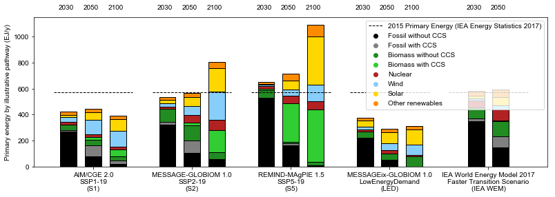
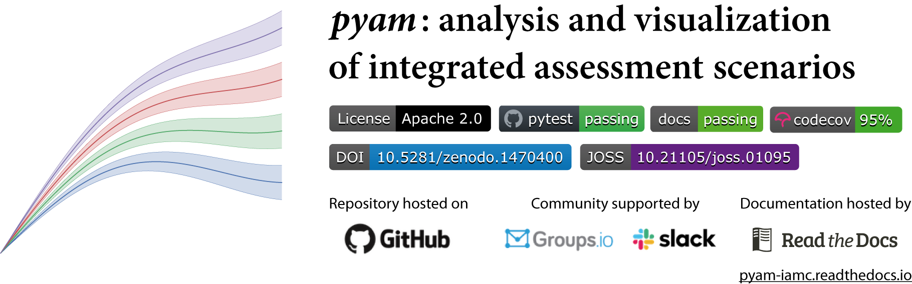

## Background

<figure style="float: right; ">
  <a href="https://www.ipcc.ch/sr15">
  
  <figcaption style="text-align: center; color: grey; font-size: small">
  Cover of the IPCC SR15</figcaption></a>
</figure>

The IPCC's *Special Report on Global Warming of 1.5°C* (SR15), published in October 2018,
presented the latest research on anthropogenic climate change.
It was written in response to the 2015 UNFCCC's "Paris Agreement" of 

> holding the increase in the global average temperature to well below 2 °C
> above pre-industrial levels and to pursue efforts to limit the temperature increase to 1.5 °C [...]".

cf. [Article 2.1.a of the Paris Agreement](https://unfccc.int/process-and-meetings/the-paris-agreement/the-paris-agreement)

As part of the SR15 assessment, an ensemble of quantitative, model-based scenarios
was compiled to underpin the scientific analysis.
Many of the headline statements widely reported by media
are based on this scenario ensemble, including the finding that

> global net anthropogenic CO2 emissions decline by ~45% from 2010 levels by 2030

in all pathways limiting global warming to 1.5°C  
(cf. [statement C.1](https://www.ipcc.ch/sr15/chapter/spm/) in the *Summary For Policymakers*).

## Open-source notebooks for transparency and reproducibility of the assessment

When preparing the SR15, the authors wanted to go beyond previous reports
not just regarding the scientific rigor and scope of the analysis,
but also establish new standards in terms of openness, transparency and reproducibility.

The scenario ensemble was made accessible via an interactive *IAMC 1.5°C Scenario Explorer*
([link](http://data.ene.iiasa.ac.at/iamc-1.5c-explorer/#/workspaces)) in line with the
[FAIR principles for scientific data management and stewardship](https://www.go-fair.org/fair-principles/).
The process for compiling, validating and analyzing the scenario ensemble
was described in an open-access manuscript published in *Nature Climate Change*  
(doi: [10.1038/s41558-018-0317-4](https://doi.org/)).

In addition, the Jupyter notebooks generating many of the headline statements,
tables and figures (using Matplotlib) were released under an open-source license
to facilitate a better understanding of the analysis
and enable reuse for subsequent research.
The notebooks are available in [rendered format](https://data.ene.iiasa.ac.at/sr15_scenario_analysis)
and on [GitHub](https://github.com/iiasa/ipcc_sr15_scenario_analysis).

<figure style="width: 600px ">
  
  <figcaption style="text-align: center; color: grey; font-size: small">
  Figure 2.4 of the IPCC SR15, showing the range of assumptions of socio-economic drivers 
  across the IAMC 1.5°C Scenario Ensemble 
  Drawn with Matplotlib, source code available <a href="https://data.ene.iiasa.ac.at/sr15_scenario_analysis/assessment/sr15_2.3.1_range_of_assumptions.html">here</a>
  </figcaption>
</figure>

<figure style="width: 600px ">
  
  <figcaption style="text-align: center; color: grey; font-size: small">
  Figure 2.15 of the IPCC SR15, showing the primary energy development in illustrative pathways 
  Drawn with Matplotlib, source code available <a href="https://data.ene.iiasa.ac.at/sr15_scenario_analysis/assessment/sr15_2.4.2.1_primary_energy_marker-scenarios.html">here</a>
  </figcaption>
</figure>

## A package for scenario analysis & visualization

To facilitate reusability of the scripts and plotting utilities
developed for the SR15 analysis, we started the open-source Python package **pyam**
as a toolbox for working with scenarios from integrated-assessment and energy system models.

The package is a wrapper for [pandas](https://pandas.pydata.org) and Matplotlib
geared for several data formats commonly used in energy modelling.
[Read the docs!](https://pyam-iamc.readthedocs.io)

