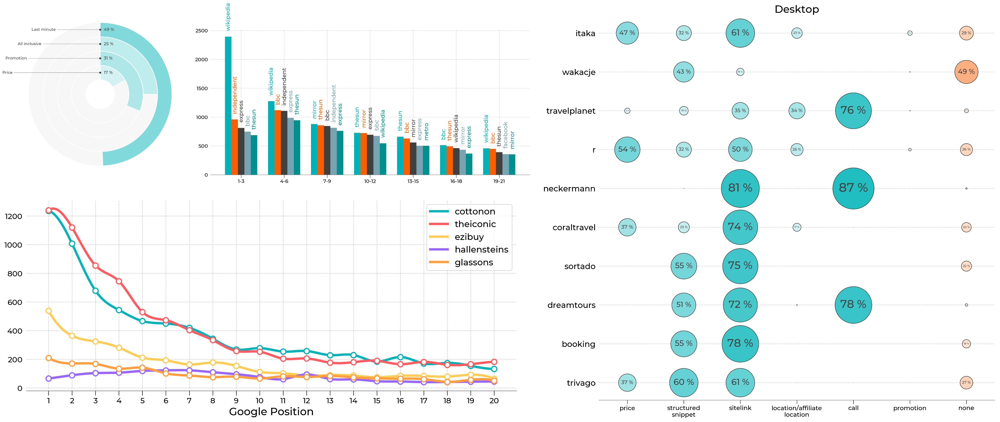
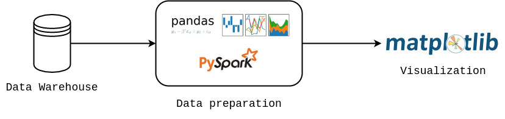
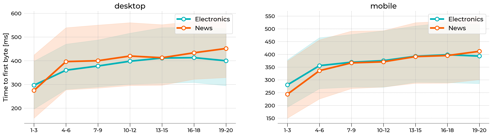
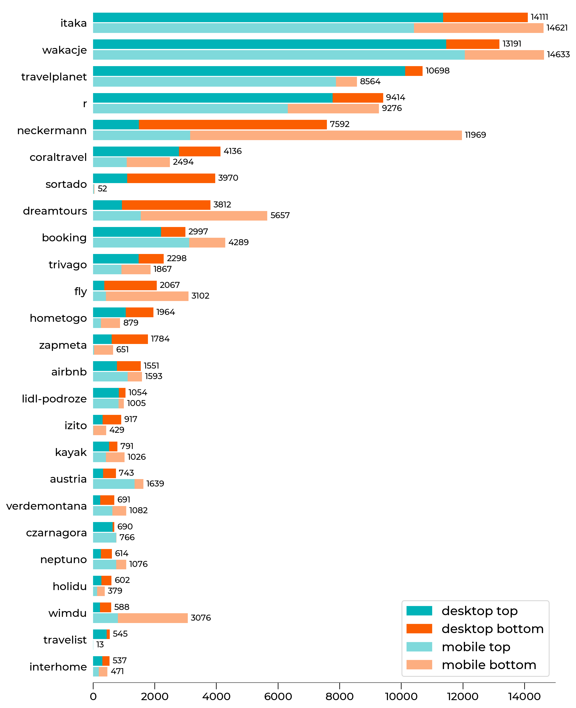

[Whites Agency](https://whites.agency/) is a digital marketing partner with a strong focus on Data-driven SEO. What makes us unique is our own technology & a team of self-driven specialists. Our data scientists are passionate about using AI solutions that maximize SEO success for the clients. We run many Big Data analyses which enables us to find the most accurate optimization opportunities leading to higher positions in Google. Some of the researches we've carried out so far concentrated on Google ranking factors in [eCommerce](https://whites.agency/blog/seo-analysis-in-ecommerce-with-the-use-of-big-data/), [football category](https://whites.agency/blog/a-70-increase-in-conversion-rate-within-a-month-due-to-data-driven-seo-a-case-study-of-the-football-website-sporticos/) and [clothing market](https://whites.agency/blog/what-everyone-in-the-fashion-industry-should-know-about-seo-in-new-zealand-big-data-analysis/). We also perform comparative analysis of large scale [website speed performance](https://whites.agency/blog/google-lighthouse-study-seo-ranking-factors-in-ecommerce-vs-news/). 

[White Dog Technology](https://whites.agency/our-technology/) is our response to frequent changes in Google's algorithm and the development of AI solutions. Our work got recognized and therefore we are a beneficient of research and industrial grant that allows us to develop new functions of our technology. Moreover, we are the authors of White Crow Technology - an automated tool for researching and analyzing Google's paid campaigns. Our data-driven SEO based on real data rather than old-fashioned practices ensures an optimal decision-making process for the clients we work with.

# Data Visualization in Python using matplotlib
Majority of cases we are dealing with right now focus on data harvesting and analysis. In blogging, data presentation plays an important part and since the beginning, we needed a tool that would allow us to experiment with different forms of visualizations. Because our organization is Python driven, matplotlib was a straightforward choice for us. It is a mature project that offers flexibility and control. Among other features, matplotlib figures can be easily exported not only to raster graphic formats (png, jpg) but also to vector ones (SVG, PDF, EPS), creating high-quality images that can be embedded in HTML code, LaTeX or utilized by graphic designers. In one of our projects, matplotlib was a part of the Python processing pipeline that automatically generated pdf summaries from an HTML template for individual clients.  



We choose two cases that demonstrate how matplotlib is used in our organization. Every data visualization project has the same core presented in the figure above, where data is loaded from the database, processed in pandas or PySpark and finally visualized with matplotlib. In each case we set up a global style, which is the basis for all figures (overwritten if necessary):
```
import matplotlib.pyplot as plt
from cycler import cycler

colors = ['#00b2b8', '#fa5e00', '#404040', '#78A3B3', '#008F8F', '#ADC9D6']

plt.rc('axes', grid=True, labelcolor='k', linewidth=0.8, edgecolor='#696969', 
    labelweight='medium', labelsize=18)
plt.rc('axes.spines', left=False, right=False, top=False, bottom=True)
plt.rc('axes.formatter', use_mathtext=True)

plt.rcParams['axes.prop_cycle'] = cycler('color', colors)

plt.rc('grid', alpha=1.0, color='#B2B2B2', linestyle='dotted', linewidth=1.0)
plt.rc('xtick.major', top=False, width=0.8, size=8.0)
plt.rc('ytick', left=False, color='k')
plt.rcParams['xtick.color'] = 'k'
plt.rc('font',family='Montserrat')
plt.rcParams['font.weight'] = 'medium'
plt.rcParams['xtick.labelsize'] = 13
plt.rcParams['ytick.labelsize'] = 13
plt.rcParams['lines.linewidth'] = 2.0
```
## Case 1: Website Speed Performance
Our R&D department analyzed a set of 10,000 potential customer intent phrases from ​​the “Electronics” (eCommerce) and “News” domains (5000 phrases each). Using our own White Dog technology, we scraped data from the Google ranking in a specific location (London, United Kingdom) both for mobile and desktop results.
Based on those data, we distinguished TOP 20 results that appeared in SERPs. Then each page was audited with the [Google Lighthouse tool](https://developers.google.com/web/tools/lighthouse). Google Lighthouse is an open-source, automated tool for improving the quality of web pages. A single sample from our analysis which shows variations of *Time to First Byte* (TTFB) as a function of Google position (grouped in threes) is presented below. TTFB measures the time it takes for a user's browser to receive the first byte of page content. Regardless of the device, TTFB score is the lowest for websites that occurred in TOP 3 positions. The difference is significant, especially between TOP 3 and 4-6 results.



The figure above uses `fill_between` function from matplotlib library to draw colored shade that represents the 40-60th percentile range.  A simple line plot with circle markers denotes the median (50th percentile). X-axis labels were assigned manually. The whole style is wrapped into a custom function that allows us to reproduce the whole figure in a single line of code. A sample of our code is presented below: 

```
import matplotlib.pyplot as plt
from matplotlib.colors import LinearSegmentedColormap

# --------------------------------------------
# Set double column layout 
# --------------------------------------------
fig, axx = plt.subplots(figsize=(20,6), ncols=2)

# --------------------------------------------
# Plot 50th percentile
# --------------------------------------------
line_kws = {
   'lw': 4.0,
   'marker': 'o',
   'ms': 9,
   'markerfacecolor': 'w',
   'markeredgewidth': 2,
   'c': '#00b2b8'
}

# just demonstration
axx[0].plot(x, y, label='Electronics', **line_kws)

# --------------------------------------------
# Plot 40-60th percentile
# --------------------------------------------
# make color lighter
cmap = LinearSegmentedColormap.from_list('whites', ['#FFFFFF', '#00b2b8'])

# just demonstration
axx[0].fill_between(
   x, yl, yu,
   color=cmap(0.5),
   label='_nolegend_'
)

# ---------------------------------------------
# Add x-axis labels
# ---------------------------------------------
# done automatically
xtick_labels = ['1-3','4-6','7-9','10-12','13-15','16-18','19-20']
for ax in axx:
   ax.set_xticklabels(xtick_labels)

# ----------------------------------------------
# Export figure
# ----------------------------------------------
fig.savefig("lighthouse.png", bbox_inches='tight', dpi=250)
```

## Case 2: Google Ads ranking
Our R&D department looked into paid campaigns (Ads) for more than 7600 queries focused around the travel category in Poland [Available only in [Polish](https://agencjawhites.pl/aktualnosci/ponad-1000-graczy-walczy-o-polskiego-turyste-w-wyszukiwarce-google/)] in Google Search. We scraped the first page in Google and analyzed the ads that were present. At the moment of writing this post, each result can have up to 4 ads at the top and up to 3 ads at the bottom. Each ad belongs to some domain and has a headline, description, and optional extensions. Below we present TOP 25 domains with the highest visibility on desktop computers. The Y-axis shows the name of a domain and the X-axis indicates how many times a domain appeared in an ad. We repeated the study 3 times and aggregated the counts. That is why the scale is much larger than 7600. In this project, the type of plot below allows us to summarize different brands' ads campaign strategies and their advertising market shares. For example, *itaka* and *wakacje* have the strongest presence both on mobile and desktop and most of their ads appear at the top. The *neckermann* positions itself are very high, but most of their ads appear at the bottom of search results. 



The figure above is a standard horizontal bar plot that can be reproduced with `barh` function in matplotlib. Each y-tick has 4 different pieces (see legend). We also added automatically generated count numbers at the end of each bar for better readability. The code snippet is shown below:

```
import matplotlib.pyplot as plt
import matplotlib.patches as mpatches
from matplotlib.colors import LinearSegmentedColormap, PowerNorm

# -----------------------------
# Set default colors
# -----------------------------
blues = LinearSegmentedColormap.from_list(name='WhitesBlues', colors=['#FFFFFF', '#00B3B8'], gamma=1.0)
oranges = LinearSegmentedColormap.from_list(name='WhitesOranges', colors=['#FFFFFF', '#FB5E01'], gamma=1.0)

# colors
desktop_top = blues(1.0)
desktop_bottom = oranges(1.0)
mobile_top = blues(0.5)
mobile_bottom = oranges(0.5)

# -----------------------------
# Prepare Figure
# -----------------------------
fig, ax = plt.subplots(figsize=(10,15))
ax.grid(False)

# -----------------------------
# Plot bars
# -----------------------------
# just demonstration

for name in yticklabels:
    # tmp_desktop - DataFrame with desktop data
    # tmp_mobile - DataFrame with mobile data 
        
    ax.barh(cnt, tmp_desktop['top'], color=desktop_top, height=0.9)
    ax.barh(cnt, tmp_desktop['bottom'], left=tmp_desktop['top'], color=desktop_bottom, height=0.9)
    # text counter
    ax.text(tmp_desktop['all']+100, cnt, "%d" % tmp_desktop['all'], horizontalalignment='left',
            verticalalignment='center', fontsize=10)
        
    ax.barh(cnt-1, tmp_mobile['top'], color=mobile_top, height=0.9)
    ax.barh(cnt-1, tmp_mobile['bottom'], left=tmp_mobile['top'], color=mobile_bottom, height=0.9)
    ax.text(tmp_mobile['all']+100, cnt-1, "%d" % tmp_mobile['all'], horizontalalignment='left',
            verticalalignment='center', fontsize=10)
        
        
    yticks.append(cnt)
        
    cnt = cnt - 2.5

# -----------------------------
# set labels
# -----------------------------
ax.set_yticks(yticks)
ax.set_yticklabels(yticklabels)

# -----------------------------
# Add legend manually
# -----------------------------
legend_elements = [
    mpatches.Patch(color=desktop_top, label='desktop top'),
    mpatches.Patch(color=desktop_bottom, label='desktop bottom'),
    mpatches.Patch(color=mobile_top, label='mobile top'),
    mpatches.Patch(color=mobile_bottom, label='mobile bottom')
]
    
ax.legend(handles=legend_elements, fontsize=15)
```
# Summary
The matplotlib library meets our needs in terms of visual capabilities and flexibility. It allows us to create standard plots in a single line of code, as well as experiment with different forms of graphs thanks to its lower level features. Thanks to opportunities offered by matplotlib we may present the complicated data in a simple and reader-friendly way. 
