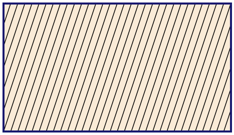
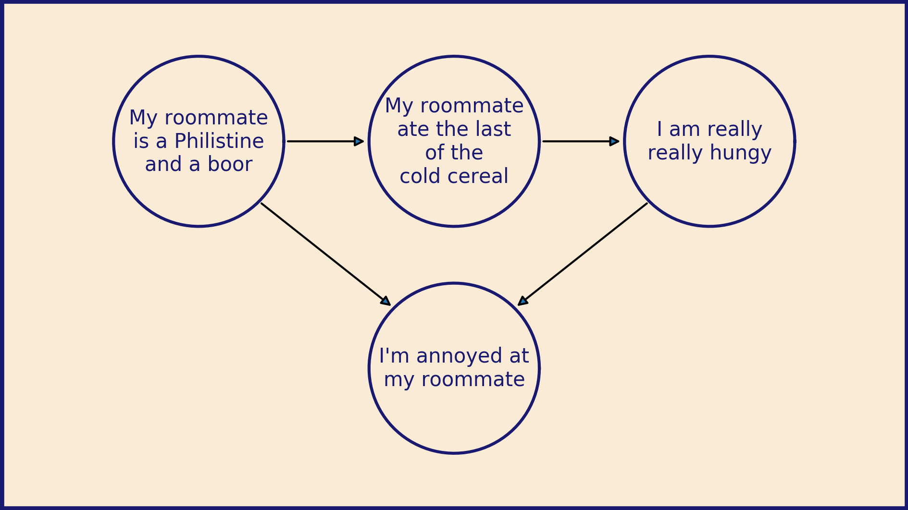

# Matplotlib for diagrams

This is my first post for the Matplotlib blog so I wanted to lead
with an example of what I most love about it:
How much control Matplotlib gives you.
I like to use it as a programmable drawing tool that happens
to be good at plotting data.

The default layout for Matplotlib works great for a lot of things,
but sometimes you want to exert
more control. Sometimes you want to treat your figure window as
a blank canvas and create diagrams
to communicate your ideas. Here, we will walk through the process
for setting this up. Most of these tricks are detailed in
[this cheat sheet for laying out plots](https://e2eml.school/matplotlib_framing.html).


```python
import matplotlib.pyplot as plt
import numpy as np
```

The first step is to choose the size of your canvas.

(Just a heads up, I love the metaphor
of the canvas, so that’s how I am using the term here.
The Canvas object is a very specific
thing in the Matplotlib code base. That's not what I'm referring to.)

I’m planning to make a diagram that is 16 centimeters wide
and 9 centimeters high.
This will fit comfortably on a piece of A4 or US Letter paper
and will be almost twice as wide as it is high.
It also scales up nicely to fit on a wide-format slide presentation.

The `plt.figure()` function accepts a `figsize` argument,
a tuple of `(width, height)` in **inches**.
To convert from centimeters, we'll divide by 2.54.

```python
fig_width = 16  # cm
fig_height = 9  # cm
fig = plt.figure(figsize=(fig_width / 2.54, fig_height / 2.54))
```

The next step is to add an Axes object that we can draw on.
By default, Matplotlib will size and place the Axes to leave
a little border and room for x- and y-axis labels. However, we don't
want that this time around. We want our Axes to extend right up
to the edge of the Figure.

The `add_axes()` function lets us specify exactly where to place
our new Axes and how big to make it. It accepts a tuple of the format
`(left, bottom, width, height)`. The coordinate frame of the Figure
is always (0, 0) at the bottom left corner and (1, 1) at the upper right,
no matter what size of Figure you are working with. Positions, widths,
and heights all become fractions of the total width and height of the Figure.

To fill the Figure with our Axes entirely, we specify a left position of 0,
a bottom position of 0, a width of 1, and a height of 1.

```python
ax = fig.add_axes((0, 0, 1, 1))
```

To make our diagram creation easier, we can set the axis limits so that
one unit in the figure equals one centimeter. This grants us
an intuitive way to control the size of objects in the diagram.
A circle with a radius of 2 will be drawn as a circle (not an ellipse)
in the final image and have a radius of 2 cm.

```python
ax.set_xlim(0, fig_width)
ax.set_ylim(0, fig_height)
```

We can also do away with the automatically generated ticks
and tick labels with this pair of calls.

```python
ax.tick_params(bottom=False, top=False, left=False, right=False)
ax.tick_params(labelbottom=False, labeltop=False, labelleft=False, labelright=False)
```

At this point we have a big blank space of exactly the right size and shape.
Now we can begin building our diagram. The foundation of the image will be
the background color. White is fine, but sometimes it's fun to mix it up.
[Here are some ideas](https://e2eml.school/matplotlib_lines.html#color)
to get you started.

```python
ax.set_facecolor("antiquewhite")
```

We can also add a border to the diagram to visually set it apart.

```python
ax.spines["top"].set_color("midnightblue")
ax.spines["bottom"].set_color("midnightblue")
ax.spines["left"].set_color("midnightblue")
ax.spines["right"].set_color("midnightblue")
ax.spines["top"].set_linewidth(4)
ax.spines["bottom"].set_linewidth(4)
ax.spines["left"].set_linewidth(4)
ax.spines["right"].set_linewidth(4)
```

Now we have a foundation and background in place
and we're finally ready to start drawing.
You have complete freedom to
[draw curves and shapes](https://e2eml.school/matplotlib_lines.html),
[place points](https://e2eml.school/matplotlib_points.html),
and [add text](https://e2eml.school/matplotlib_text.html)
of any variety within our 16 x 9 garden walls.

Then when you're done, the last step is to save the figure out as a
`.png` file. In this format it can be imported to and added to whatever
document or presentation you're working on

```python
fig.savefig("blank_diagram.png", dpi=300)
```


If you're making a collection of diagrams,
you can make a convenient template for your blank canvas.

```python
def blank_diagram(fig_width=16, fig_height=9,
                  bg_color="antiquewhite", color="midnightblue"):
    fig = plt.figure(figsize=(fig_width / 2.54, fig_height / 2.54))
    ax = fig.add_axes((0, 0, 1, 1))
    ax.set_xlim(0, fig_width)
    ax.set_ylim(0, fig_height)
    ax.set_facecolor(bg_color)

    ax.tick_params(bottom=False, top=False,
                   left=False, right=False)
    ax.tick_params(labelbottom=False, labeltop=False,
                   labelleft=False, labelright=False)

    ax.spines["top"].set_color(color)
    ax.spines["bottom"].set_color(color)
    ax.spines["left"].set_color(color)
    ax.spines["right"].set_color(color)
    ax.spines["top"].set_linewidth(4)
    ax.spines["bottom"].set_linewidth(4)
    ax.spines["left"].set_linewidth(4)
    ax.spines["right"].set_linewidth(4)

    return fig, ax
```

Then you can take that canvas and add arbitrary text, shapes, and lines.

```python
fig, ax = blank_diagram()

for x0 in np.arange(-3, 16, .5):
    ax.plot([x0, x0 + 3], [0, 9], color="black")

fig.savefig("stripes.png", dpi=300)
```



Or more intricately:

```python
fig, ax = blank_diagram()

centers = [(3.5, 6.5), (8, 6.5), (12.5, 6.5), (8, 2.5)]
radii = 1.5
texts = [
    "\n".join(["My roomate", "is a Philistine", "and a boor"]),
    "\n".join(["My roomate", "ate the last", "of the", "cold cereal"]),
    "\n".join(["I am really", "really hungy"]),
    "\n".join(["I'm annoyed", "at my roomate"]),
]

# Draw circles with text in the center
for i, center in enumerate(centers):
    x, y = center
    theta = np.linspace(0, 2 * np.pi, 100)
    ax.plot(
        x + radii * np.cos(theta),
        y + radii * np.sin(theta),
        color="midnightblue",
    )
    ax.text(
        x, y,
        texts[i],
        horizontalalignment="center",
        verticalalignment="center",
        color="midnightblue",
    )

# Draw arrows connecting them
# https://e2eml.school/matplotlib_text.html#annotate
ax.annotate(
    "",
    (centers[1][0] - radii, centers[1][1]),
    (centers[0][0] + radii, centers[0][1]),
    arrowprops=dict(arrowstyle = "-|>"),
)
ax.annotate(
    "",
    (centers[2][0] - radii, centers[2][1]),
    (centers[1][0] + radii, centers[1][1]),
    arrowprops=dict(arrowstyle = "-|>"),
)
ax.annotate(
    "",
    (centers[3][0] - .7 * radii, centers[3][1] + .7 * radii),
    (centers[0][0] + .7 * radii, centers[0][1] - .7 * radii),
    arrowprops=dict(arrowstyle = "-|>"),
)
ax.annotate(
    "",
    (centers[3][0] + .7 * radii, centers[3][1] + .7 * radii),
    (centers[2][0] - .7 * radii, centers[2][1] - .7 * radii),
    arrowprops=dict(arrowstyle = "-|>"),
)

fig.savefig("causal.png", dpi=300)
```



Once you get started on this path, you can start making
extravagantly annotated plots. It can elevate your data
presentations to true storytelling.

Happy diagram building!
