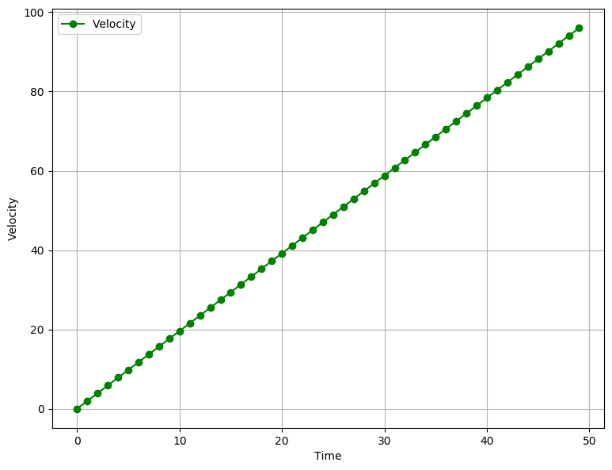
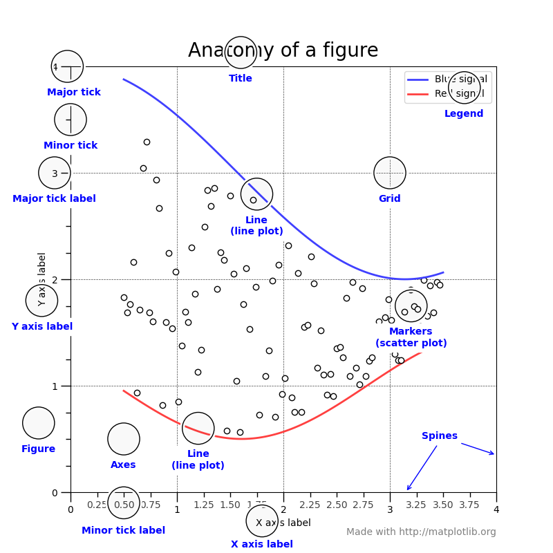

## Generating the data points

To get acquainted with the basics of plotting with `matplotlib`, let's try plotting how much distance an object under free-fall travels with respect to time and also, its velocity at each time step.

If, you have ever studied physics, you can tell that is a classic case of Newton's equations of motion, where

$$ v = a \times t $$

$$ S = 0.5 \times a \times t^{2} $$

We will assume an initial velocity of zero.

```python
import numpy as np

time = np.arange(0., 10., 0.2)
velocity = np.zeros_like(time, dtype=float)
distance = np.zeros_like(time, dtype=float)
```

We know that under free-fall, all objects move with the constant acceleration of $$g = 9.8~m/s^2$$

```python
g = 9.8 	# m/s^2

velocity = g * time
distance = 0.5 * g * np.power(time, 2)
```

The above code gives us two `numpy` arrays populated with the distance and velocity data points.

## Pyplot vs. Object-Oriented interface

When using `matplotlib` we have two approaches:
1. `pyplot` interface / functional interface.
2. Object-Oriented interface (OO).

### Pyplot Interface

`matplotlib` on the surface is made to imitate MATLAB's method of generating plots, which is called `pyplot`. All the `pyplot` commands make changes and modify the same figure. This is a state-based interface, where the state (i.e., the figure) is preserved through various function calls (i.e., the methods that modify the figure). This interface allows us to quickly and easily generate plots. The state-based nature of the interface allows us to add elements and/or modify the plot as we need, when we need it.

This interface shares a lot of similarities in syntax and methodology with MATLAB. For example, if we want to plot a blue line where each data point is marked with a circle, we can use the string `'bo-'`.

```python
import matplotlib.pyplot as plt

plt.figure(figsize=(9,7), dpi=100)
plt.plot(time,distance,'bo-')
plt.xlabel("Time")
plt.ylabel("Distance")
plt.legend(["Distance"])
plt.grid(True)
```

The plot shows how much distance was covered by the free-falling object with each passing second.


<div class="image-caption">
<b>Fig. 1.1</b> The amount of distance travelled in each second is increasing, which is a direct result of increasing velocity due to the gravitational acceleration.
</div>

```python
plt.figure(figsize=(9,7), dpi=100)
plt.plot(time, velocity,'go-')
plt.xlabel("Time")
plt.ylabel("Velocity")
plt.legend(["Velocity"])
plt.grid(True)
```

The plot below shows us how the velocity is increasing.


<div class="image-caption">
<b>Fig. 1.2</b> Velocity is increasing in fixed steps, due to a "constant" acceleration.
</div>

Let's try to see what kind of plot we get when we plot both distance and velocity in the same plot.

```python
plt.figure(figsize=(9,7), dpi=100)
plt.plot(time, velocity,'g-')
plt.plot(time, distance,'b-')
plt.ylabel("Distance and Velocity")
plt.xlabel("Time")
plt.legend(["Distance", "Velocity"])
plt.grid(True)
```


Here, we run into some obvious and serious issues. We can see that since both the quantities share the same axis but have very different magnitudes, the graph looks disproportionate. What we need to do is separate the two quantities on two different axes. This is where the second approach to making plot comes into play.

Also, the `pyplot` approach doesn't really scale when we are required to make multiple plots or when we have to make intricate plots that require a lot of customisation. However, internally `matplotlib` has an Object-Oriented interface that can be accessed just as easily, which allows to reuse objects.

### Object-Oriented Interface

When using the OO interface, it helps to know how the `matplotlib` structures its plots. The final plot that we see as the output is a 'Figure' object. The `Figure` object is the top level container for all the other elements that make up the graphic image. These "other" elements are called `Artists`. The `Figure` object can be thought of as a canvas, upon which different artists act to create the final graphic image. This `Figure` can contain any number of various artists.



Things to note about the anatomy of a figure are:
1. All of the items labelled in *blue* are `Artists`. `Artists` are basically all the elements that are rendered onto the figure. This can include text, patches (like arrows and shapes), etc. Thus, all the following `Figure`, `Axes` and `Axis` objects are also Artists.
2. Each plot that we see in a figure, is an `Axes` object. The `Axes` object holds the actual data that we are going to display. It will also contain X- and Y-axis labels, a title. Each `Axes` object will contain two or more `Axis` objects.
3. The `Axis` objects set the data limits. It also contains the ticks and ticks labels. `ticks` are the marks that we see on a axis.

Understanding this hierarchy of `Figure`, `Artist`, `Axes` and `Axis` is immensely important, because it plays a crucial role in how me make an animation in `matplotlib`.

Now that we understand how plots are generated, we can easily solve the problem we faced earlier. To make Velocity and Distance plot to make more sense, we need to plot each data item against a seperate axis, with a different scale. Thus, we will need one parent `Figure` object and two `Axes` objects.

```python
fig, ax1 = plt.subplots()

ax1.set_ylabel("distance (m)")
ax1.set_xlabel("time")
ax1.plot(time, distance, "blue")

ax2 = ax1.twinx() # create another y-axis sharing a common x-axis

ax2.set_ylabel("velocity (m/s)")
ax2.set_xlabel("time")
ax2.plot(time, velocity, "green")

fig.set_size_inches(7,5)
fig.set_dpi(100)

plt.show()
```


This plot is still not very intuitive. We should add a grid and a legend. Perhaps, we can also change the color of the axis labels and tick labels to the color of the lines.

But, something very weird happens when we try to turn on the grid, which you can see [here](https://github.com/whereistejas/whereistejas.github.io/blob/master/assets/jupyter-nb/double-pendulum-part-1-basics-of-plotting.ipynb) at Cell 8. The grid lines don't align with the tick labels on the both the Y-axes. We can see that tick values `matplotlib` is calculating on its own are not suitable to our needs and, thus, we will have to calculate them ourselves.

```python
fig, ax1 = plt.subplots()

ax1.set_ylabel("distance (m)", color="blue")
ax1.set_xlabel("time")
ax1.plot(time, distance, "blue")
ax1.set_yticks(np.linspace(*ax1.get_ybound(), 10))
ax1.tick_params(axis="y", labelcolor="blue")
ax1.xaxis.grid()
ax1.yaxis.grid()

ax2 = ax1.twinx() # create another y-axis sharing a common x-axis

ax2.set_ylabel("velocity (m/s)", color="green")
ax2.set_xlabel("time")

ax2.tick_params(axis="y", labelcolor="green")
ax2.plot(time, velocity, "green")
ax2.set_yticks(np.linspace(*ax2.get_ybound(), 10))

fig.set_size_inches(7,5)
fig.set_dpi(100)
fig.legend(["Distance", "Velocity"])
plt.show()
```

The command `ax1.set_yticks(np.linspace(*ax1.get_ybound(), 10))` calculates the tick values for us. Let's break this down to see what is happening:
1. The `np.linspace` command will create a set of `n` no. of partitions between a specified upper and lower limit.
2. The method `ax1.get_ybound()` returns a list which contains the maximum and minimum limits for that particular axis (which in our case is the Y-axis).
3. In python, the operator `*` acts as an unpacking operator when prepended before a `list` or `tuple`. Thus, it will convert a list `[1, 2, 3, 4]` into seperate values `1, 2, 3, 4`. This is an immensely powerful feature.
4. Thus, we are asking the `np.linspace` method to divide the interval between the maximum and minimum tick values into 10 equal parts.
5. We provide this array to the `set_yticks` method.

The same process is repeated for the second axis.


## Conclusion

In this part, we covered some basics of `matplotlib` plotting, covering the basic two approaches of how to make plots. In the next part, we will cover how to make simple animations. If you like the content of this blog post, or you have any suggestions or comments, drop me an email or tweet or ping me on IRC. Nowadays, you will find me hanging around #matplotlib on Freenode. Thanks!

## After-thoughts
This post is part of a series I'm doing on my personal [blog](http://whereistejas.me). This series is basically going to be about how to animate stuff using python's `matplotlib` library. `matplotlib` has an excellent [documentation](https://matplotlib.org/3.2.1/contents.html) where you can find a detailed documentation on each of the methods I have used in this blog post. Also, I will be publishing each part of this series in the form of a jupyter notebook, which can be found [here](https://github.com/whereistejas/whereistejas.github.io/blob/master/assets/jupyter-nb/Part-1-basics-of-plotting.ipynb).

The series will have three posts which will cover:
1. Part 1 - How to make plots using `matplotlib`.
2. Part 2 - Basic animation using `FuncAnimation`.
3. Part 3 - Optimizations to make animations faster (blitting).

I would like to say a few words about the methodology of these series:
1. Each part will have a list of references at the end of the post, mostly leading to appropriate pages of the documentation and helpful blogs written by other people. **THIS IS THE MOST IMPORTANT PART**. The sooner you get used to reading the documentation, the better.
2. The code written here, is meant to show you how you can piece everything together. I will try my best to describe the nuances of my implementations and the tiny lessons I learned.

## References

1. [Python Generators (YouTube)](https://youtu.be/bD05uGo_sVI)
1. [Matplotlib: An Introduction to its Object-Oriented Interface](https://medium.com/@kapil.mathur1987/matplotlib-an-introduction-to-its-object-oriented-interface-a318b1530aed)
2. [Lifecycle of a Plot](https://matplotlib.org/3.2.1/tutorials/introductory/lifecycle.html)
3. [Basic Concepts](https://matplotlib.org/faq/usage_faq.html)
