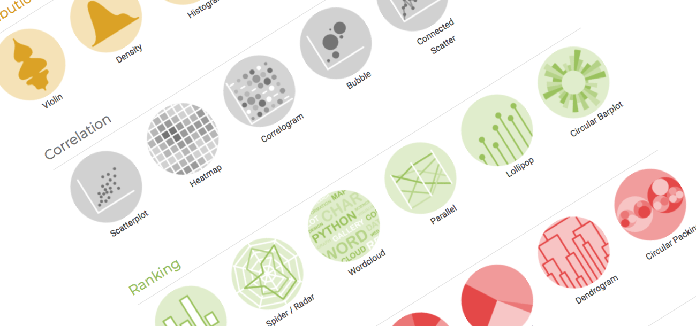
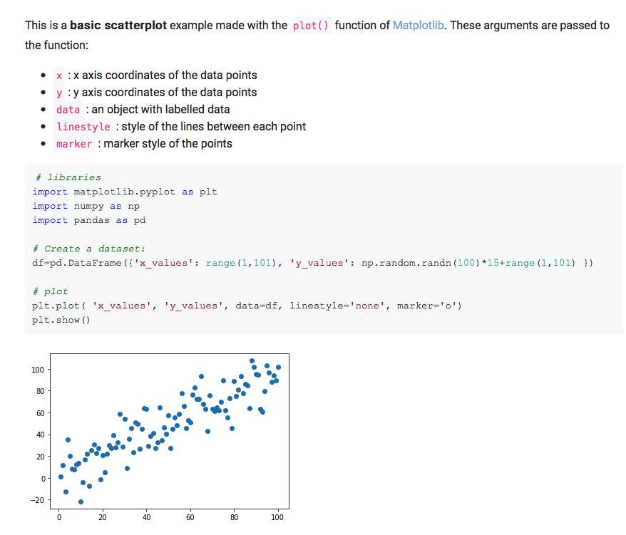
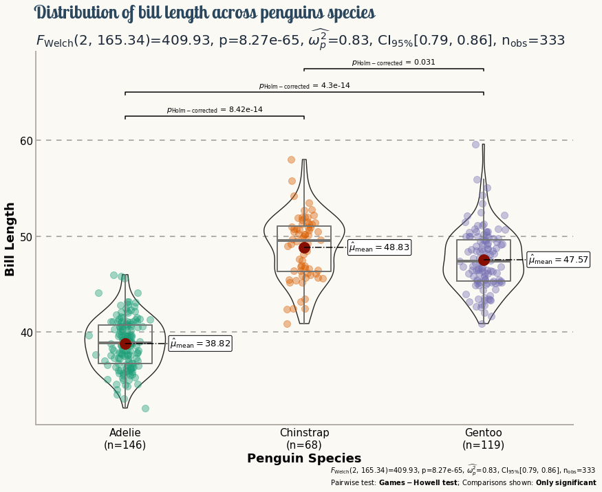

Data visualization is a key step in a data science pipeline. [Python](https://www.python.org) offers great possibilities when it comes to representing some data graphically, but it can be hard and time-consuming to create the appropriate chart.

The [Python Graph Gallery](https://www.python-graph-gallery.com) is here to help. It displays many examples, always providing the reproducible code. It allows to build the desired chart in minutes.

# About 400 charts in 40 sections

The gallery currently provides more than [300 chart examples](https://www.python-graph-gallery.com/all-charts/). Those examples are organized in 40 sections, one for each chart types: [scatterplot](), [boxplot](https://www.python-graph-gallery.com/boxplot/), [barplot](https://www.python-graph-gallery.com/barplot/), [treemap](https://www.python-graph-gallery.com/treemap/) and so on. Those chart types are organized in 7 big families as suggested by [data-to-viz.com](https://www.data-to-viz.com): one for each visualization purpose.

It is important to note that not only the most common chart types are covered. Lesser known charts like [chord diagrams](https://www.python-graph-gallery.com/chord-diagram/), [streamgraphs](https://www.python-graph-gallery.com/streamchart/) or [bubble maps](https://www.python-graph-gallery.com/bubble-map/) are also available.

# Master the basics

Each section always starts with some very basic examples. It allows to understand how to build a chart type in a few seconds. Hopefully applying the same technique on another dataset will thus be very quick.

For instance, the [scatterplot section](https://www.python-graph-gallery.com/scatter-plot/) starts with this [matplotlib](https://matplotlib.org/) example. It shows how to create a dataset with [pandas](https://pandas.pydata.org/) and plot it with the `plot()` function. The main graph argument like `linestyle` and `marker` are described to make sure the code is understandable.

[_blogpost overview_:](https://www.python-graph-gallery.com/130-basic-matplotlib-scatterplot)

# Matplotlib customization

The gallery uses several libraries like [seaborn](https://www.python-graph-gallery.com/seaborn/) or [plotly](https://www.python-graph-gallery.com/plotly/) to produce its charts, but is mainly focus on matplotlib. Matplotlib comes with great flexibility and allows to build any kind of chart without limits.

A [whole page](https://www.python-graph-gallery.com/matplotlib/) is dedicated to matplotlib. It describes how to solve recurring issues like customizing [axes](https://www.python-graph-gallery.com/191-custom-axis-on-matplotlib-chart) or [titles](https://www.python-graph-gallery.com/190-custom-matplotlib-title), adding [annotations](https://www.python-graph-gallery.com/193-annotate-matplotlib-chart) (see below) or even using [custom fonts](https://www.python-graph-gallery.com/custom-fonts-in-matplotlib).

The gallery is also full of non-straightforward examples. For instance, it has a [tutorial](https://www.python-graph-gallery.com/streamchart-basic-matplotlib) explaining how to build a streamchart with matplotlib. It is based on the `stackplot()` function and adds some smoothing to it:

Last but not least, the gallery also displays some publication ready charts. They usually involve a lot of matplotlib code, but showcase the fine grain control one has over a plot.

Here is an example with a post inspired by [Tuo Wang](https://www.r-graph-gallery.com/web-violinplot-with-ggstatsplot.html)'s work for the tidyTuesday project. (Code translated from R available [here](https://www.python-graph-gallery.com/web-ggbetweenstats-with-matplotlib))

# Contributing

The python graph gallery is an ever growing project. It is open-source, with all its related code hosted on [github](https://github.com/holtzy/The-Python-Graph-Gallery).

Contributions are very welcome to the gallery. Each blogpost is just a jupyter notebook so suggestion should be very easy to do through issues or pull requests!

# Conclusion

The [python graph gallery](https://www.python-graph-gallery.com) is a project developed by [Yan Holtz](https://www.yan-holtz.com) in his free time. It can help you improve your technical skills when it comes to visualizing data with python.

The gallery belongs to an ecosystem of educative websites. [Data to viz](https://www.data-to-viz.com) describes best practices in data visualization, the [R](https://www.r-graph-gallery.com), [python](https://www.python-graph-gallery.com) and [d3.js](https://www.d3-graph-gallery.com) graph galleries provide technical help to build charts with the 3 most common tools.

For any question regarding the project, please say hi on twitter at [@R_Graph_Gallery](https://twitter.com/R_Graph_Gallery)!
