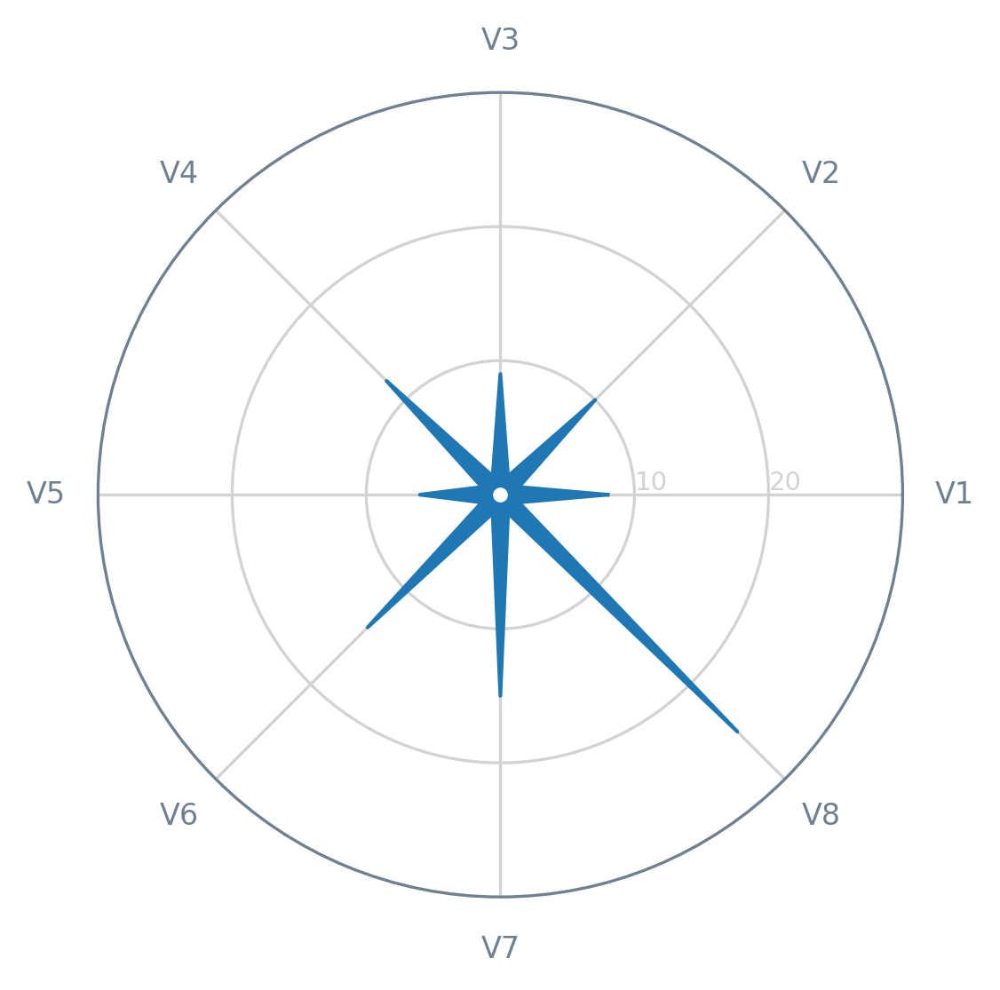

In May 2020, Alexandre Morin-Chassé published a blog post about the **stellar chart**. This type of chart is an (approximately) direct alternative to the **radar chart** (also known as web, spider, star, or cobweb chart) — you can read more about this chart [here](https://medium.com/nightingale/the-stellar-chart-an-elegant-alternative-to-radar-charts-ae6a6931a28e).


In this tutorial, we will see how we can create a quick-and-dirty stellar chart. First of all, let's get the necessary modules/libraries, as well as prepare a dummy dataset (with just a single record).

```python
from itertools import chain, zip_longest
from math import ceil, pi

import matplotlib.pyplot as plt

data = [
    ("V1", 8),
    ("V2", 10),
    ("V3", 9),
    ("V4", 12),
    ("V5", 6),
    ("V6", 14),
    ("V7", 15),
    ("V8", 25),
]
```

We will also need some helper functions, namely a function to round up to the nearest 10 (`round_up()`) and a function to join two sequences (`even_odd_merge()`). In the latter, the values of the first sequence (a list or a tuple, basically) will fill the even positions and the values of the second the odd ones.

```python
def round_up(value):
    """
    >>> round_up(25)
    30
    """
    return int(ceil(value / 10.0)) * 10


def even_odd_merge(even, odd, filter_none=True):
    """
    >>> list(even_odd_merge([1,3], [2,4]))
    [1, 2, 3, 4]
    """
    if filter_none:
        return filter(None.__ne__, chain.from_iterable(zip_longest(even, odd)))

    return chain.from_iterable(zip_longest(even, odd))
```

That said, to plot `data` on a stellar chart, we need to apply some transformations, as well as calculate some auxiliary values. So, let's start by creating a function (`prepare_angles()`) to calculate the angle of each axis on the chart (`N` corresponds to the number of variables to be plotted).

```python
def prepare_angles(N):
    angles = [n / N * 2 * pi for n in range(N)]

    # Repeat the first angle to close the circle
    angles += angles[:1]

    return angles
```

Next, we need a function (`prepare_data()`) responsible for adjusting the original data (`data`) and separating it into several easy-to-use objects.

```python
def prepare_data(data):
    labels = [d[0] for d in data]  # Variable names
    values = [d[1] for d in data]

    # Repeat the first value to close the circle
    values += values[:1]

    N = len(labels)
    angles = prepare_angles(N)

    return labels, values, angles, N
```

Lastly, for this specific type of chart, we require a function (`prepare_stellar_aux_data()`) that, from the previously calculated angles, prepares two lists of auxiliary values: a list of **intermediate angles** for each pair of angles (`stellar_angles`) and a list of small **constant values** (`stellar_values`), which will act as the values of the variables to be plotted in order to achieve the **star-like shape** intended for the stellar chart.

```python
def prepare_stellar_aux_data(angles, ymax, N):
    angle_midpoint = pi / N

    stellar_angles = [angle + angle_midpoint for angle in angles[:-1]]
    stellar_values = [0.05 * ymax] * N

    return stellar_angles, stellar_values
```

At this point, we already have all the necessary _ingredients_ for the stellar chart, so let's move on to the Matplotlib side of this tutorial. In terms of **aesthetics**, we can rely on a function (`draw_peripherals()`) designed for this specific purpose (feel free to customize it!).

```python
def draw_peripherals(ax, labels, angles, ymax, outer_color, inner_color):
    # X-axis
    ax.set_xticks(angles[:-1])
    ax.set_xticklabels(labels, color=outer_color, size=8)

    # Y-axis
    ax.set_yticks(range(10, ymax, 10))
    ax.set_yticklabels(range(10, ymax, 10), color=inner_color, size=7)
    ax.set_ylim(0, ymax)
    ax.set_rlabel_position(0)

    # Both axes
    ax.set_axisbelow(True)

    # Boundary line
    ax.spines["polar"].set_color(outer_color)

    # Grid lines
    ax.xaxis.grid(True, color=inner_color, linestyle="-")
    ax.yaxis.grid(True, color=inner_color, linestyle="-")
```

To **plot the data** and orchestrate (almost) all the steps necessary to have a stellar chart, we just need one last function: `draw_stellar()`.

```python
def draw_stellar(
    ax,
    labels,
    values,
    angles,
    N,
    shape_color="tab:blue",
    outer_color="slategrey",
    inner_color="lightgrey",
):
    # Limit the Y-axis according to the data to be plotted
    ymax = round_up(max(values))

    # Get the lists of angles and variable values
    # with the necessary auxiliary values injected
    stellar_angles, stellar_values = prepare_stellar_aux_data(angles, ymax, N)
    all_angles = list(even_odd_merge(angles, stellar_angles))
    all_values = list(even_odd_merge(values, stellar_values))

    # Apply the desired style to the figure elements
    draw_peripherals(ax, labels, angles, ymax, outer_color, inner_color)

    # Draw (and fill) the star-shaped outer line/area
    ax.plot(
        all_angles,
        all_values,
        linewidth=1,
        linestyle="solid",
        solid_joinstyle="round",
        color=shape_color,
    )

    ax.fill(all_angles, all_values, shape_color)

    # Add a small hole in the center of the chart
    ax.plot(0, 0, marker="o", color="white", markersize=3)
```

Finally, let's get our chart on a _blank canvas_ (figure).

```python
fig = plt.figure(dpi=100)
ax = fig.add_subplot(111, polar=True)  # Don't forget the projection!

draw_stellar(ax, *prepare_data(data))

plt.show()
```



It's done! Right now, you have an example of a stellar chart and the boilerplate code to add this type of chart to your _repertoire_. If you end up creating your own stellar charts, feel free to share them with the _world_ (and [me](https://twitter.com/joaompalmeiro)!). I hope this tutorial was useful and interesting for you!
