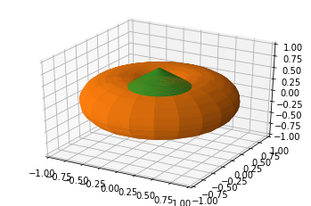
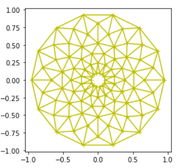

As part of the University of North Carolina BIOL222 class, [Dr. Catherine Kehl](https://twitter.com/tylikcat) asked her students to "use `matplotlib.pyplot` to make art." BIOL222 is Introduction to Programming, aimed at students with no programming background. The emphasis is on practical, hands-on active learning.

The students completed the assignment with festive enthusiasm around Halloween. Here are some great examples:

Harris Davis showed an affinity for pumpkins, opting to go 3D!

```python
# get library for 3d plotting
from mpl_toolkits.mplot3d import Axes3D

# make a pumpkin :) 
rho = np.linspace(0, 3*np.pi,32)
theta, phi = np.meshgrid(rho, rho)
r, R = .5, .5
X = (R + r * np.cos(phi)) * np.cos(theta)
Y = (R + r * np.cos(phi)) * np.sin(theta)
Z = r * np.sin(phi)

# make the stem
theta1 = np.linspace(0,2*np.pi,90)
r1 = np.linspace(0,3,50)
T1, R1 = np.meshgrid(theta1, r1)
X1 = R1 * .5*np.sin(T1)
Y1 = R1 * .5*np.cos(T1)
Z1 = -(np.sqrt(X1**2 + Y1**2) - .7)
Z1[Z1 < .3] = np.nan
Z1[Z1 > .7] = np.nan

# Display the pumpkin & stem
fig = plt.figure()
ax = fig.gca(projection = '3d')
ax.set_xlim3d(-1, 1)
ax.set_ylim3d(-1, 1)
ax.set_zlim3d(-1, 1)
ax.plot_surface(X, Y, Z, color = 'tab:orange', rstride = 1, cstride = 1)
ax.plot_surface(X1, Y1, Z1, color = 'tab:green', rstride = 1, cstride = 1)
plt.show()
```

Bryce Desantis stuck to the biological theme and demonstrated [fractal](https://en.wikipedia.org/wiki/Fractal) art.

```python
import numpy as np
import matplotlib.pyplot as plt

#Barnsley's Fern - Fractal; en.wikipedia.org/wiki/Barnsley_…

#functions for each part of fern:
#stem
def stem(x,y):
  return (0, 0.16*y)
#smaller leaflets
def smallLeaf(x,y):
  return (0.85*x + 0.04*y, -0.04*x + 0.85*y + 1.6)
#large left leaflets
def leftLarge(x,y):
  return (0.2*x - 0.26*y, 0.23*x + 0.22*y + 1.6)
#large right leftlets
def rightLarge(x,y):
  return (-0.15*x + 0.28*y, 0.26*x + 0.24*y + 0.44)
componentFunctions = [stem, smallLeaf, leftLarge, rightLarge]

# number of data points and frequencies for parts of fern generated:
#lists with all 75000 datapoints
datapoints = 75000
x, y = 0, 0
datapointsX = []
datapointsY = []
#For 75,000 datapoints
for n in range(datapoints):
  FrequencyFunction = np.random.choice(componentFunctions, p=[0.01, 0.85, 0.07, 0.07])
  x, y = FrequencyFunction(x,y)
  datapointsX.append(x)
  datapointsY.append(y)

#Scatter plot & scaled down to 0.1 to show more definition:
plt.scatter(datapointsX,datapointsY,s=0.1, color='g')
#Title of Figure
plt.title("Barnsley's Fern - Assignment 3")
#Changing background color
ax = plt.axes()
ax.set_facecolor("#d8d7bf")
```

Grace Bell got a little trippy with this rotationally semetric art. It's pretty cool how she captured mouse events. It reminds us of a flower. What do you see?

```python
import matplotlib.pyplot as plt
from matplotlib.tri import Triangulation
from matplotlib.patches import Polygon
import numpy as np

#I found this sample code online and manipulated it to make the art piece! 
#was interested in because it combined what we used for functions as well as what we used for plotting with (x,y)
def update_polygon(tri):
    if tri == -1:
        points = [0, 0, 0]
    else:
        points = triang.triangles[tri]
    xs = triang.x[points]
    ys = triang.y[points]
    polygon.set_xy(np.column_stack([xs, ys]))

def on_mouse_move(event):
    if event.inaxes is None:
        tri = -1
    else:
        tri = trifinder(event.xdata, event.ydata)
    update_polygon(tri)
    ax.set_title(f'In triangle {tri}')
    event.canvas.draw()
#this is the info that creates the angles 
n_angles = 14
n_radii = 7
min_radius = 0.1 #the radius of the middle circle can move with this variable 
radii = np.linspace(min_radius, 0.95, n_radii)
angles = np.linspace(0, 2 * np.pi, n_angles, endpoint=False)
angles = np.repeat(angles[..., np.newaxis], n_radii, axis=1)
angles[:, 1::2] += np.pi / n_angles
x = (radii*np.cos(angles)).flatten()
y = (radii*np.sin(angles)).flatten()
triang = Triangulation(x, y)
triang.set_mask(np.hypot(x[triang.triangles].mean(axis=1),
                         y[triang.triangles].mean(axis=1))
                < min_radius)

trifinder = triang.get_trifinder()

fig, ax = plt.subplots(subplot_kw={'aspect': 'equal'})
ax.triplot(triang, 'y+-') #made the color of the plot yellow and there are "+" for the data points but you can't really see them because of the lines crossing 
polygon = Polygon([[0, 0], [0, 0]], facecolor='y')
update_polygon(-1)
ax.add_patch(polygon)
fig.canvas.mpl_connect('motion_notify_event', on_mouse_move)
plt.show()
```

As a bonus, did you like that fox in the banner? That was created (and well documented) by Emily Foster!
```python
import numpy as np
import matplotlib.pyplot as plt

plt.axis('off')

#head
xhead = np.arange(-50,50,0.1)
yhead = -0.007*(xhead*xhead) + 100

plt.plot(xhead, yhead, 'darkorange')

#outer ears
xearL = np.arange(-45.8,-9,0.1)
yearL = -0.08*(xearL*xearL) -4*xearL + 70

xearR = np.arange(9,45.8,0.1)
yearR = -0.08*(xearR*xearR) + 4*xearR + 70

plt.plot(xearL, yearL, 'black')
plt.plot(xearR, yearR, 'black')

#inner ears
xinL = np.arange(-41.1,-13.7,0.1)
yinL = -0.08*(xinL*xinL) -4*xinL + 59

xinR = np.arange(13.7,41.1,0.1)
yinR = -0.08*(xinR*xinR) + 4*xinR + 59

plt.plot(xinL, yinL, 'salmon')
plt.plot(xinR, yinR, 'salmon')

# bottom of face
xfaceL = np.arange(-49.6,-14,0.1)
xfaceR = np.arange(14,49.3,0.1)
xfaceM = np.arange(-14,14,0.1)

plt.plot(xfaceL, abs(xfaceL), 'darkorange')
plt.plot(xfaceR, abs(xfaceR), 'darkorange')
plt.plot(xfaceM, abs(xfaceM), 'black')

#nose
xnose = np.arange(-14,14,0.1)
ynose = -0.03*(xnose*xnose) + 20

plt.plot(xnose, ynose, 'black')

#whiskers
xwhiskR = [50, 70, 55, 70, 55, 70, 49.3]
xwhiskL = [-50, -70, -55, -70, -55, -70, -49.3]
ywhisk = [82.6, 85, 70, 65, 60, 45, 49.3]

plt.plot(xwhiskR, ywhisk, 'darkorange')
plt.plot(xwhiskL, ywhisk, 'darkorange')

#eyes
plt.plot(20,60, color = 'black', marker = 'o', markersize = 15)
plt.plot(-20,60,color = 'black', marker = 'o', markersize = 15)

plt.plot(22,62, color = 'white', marker = 'o', markersize = 6)
plt.plot(-18,62,color = 'white', marker = 'o', markersize = 6)
```

We look forward to seeing these students continue in their plotting and scientific adventures!