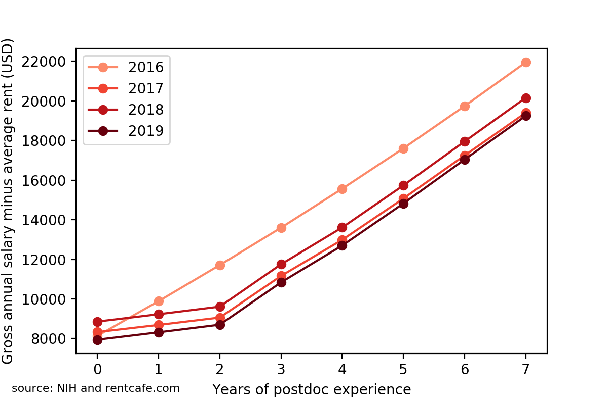

Postdocs are the [workers of academia](https://en.wikipedia.org/wiki/Postdoctoral_researcher).
They are the main players beyond the majority of scientific papers published in
journals and conferences. Yet, their effort is often not recognized in terms of
salary and benefits.

A few years ago, the NIH has established stipend levels for undergraduate,
predoctoral and postdoctoral trainees and fellows, the so-called NIH guidelines.
Many universities and research institutes currently adopt these guidelines for
deciding how much to pay postdocs.

One of the key problem of the NIH guidelines is that they are established at a
national level. This means that a postdoc in Buffalo is paid the same than a postdoc in Boston,
despite [Buffalo is one of the most affordable city to live in the USA](https://www.mentalfloss.com/article/85668/11-most-affordable-cities-us),
while [Boston is one of the most expensive](https://www.investopedia.com/articles/personal-finance/080916/top-10-most-expensive-cities-us.asp).
Every year, the NIH releases new guidelines, where the stipends are slightly
increased. **Do these adjustments help a postdoc in the Boston area
take home a bit more money?**

I have used [Matplotlib](https://matplotlib.org) to plot the NIH stipend levels
(y axis) for each year of postdoctoral experience (x axis) for the past 4 years
of NIH guidelines (color). I have also looked at the inflation of years 2017--2019
and increased the salaries of the previous year by that percentage (dashed lines).

The data revealed that the salaries of 2017 were just increased by the
inflation rate for the most senior postdocs, while junior postdocs (up to 1 year
of experience) received an increase more than 2.5 times of the inflation. In
2018, all salaries were just adjusted to the inflation. In 2019, the increase was
slightly higher than the inflation level. So, overall, every year the NIH makes
sure that the postdoc salaries are, at least, adjusted to the inflation. Great!

As mentioned earlier, there are cities in the US that are more expensive than
others, for example Boston. To partially account for such differences when
looking at the postdoc salaries, I subtracted from each salary the average rent
for a one-bedroom apartment in Boston.
Of course, it also increases every year, but, unfortunately for postdocs, **rent
increases way more than the inflation**. The results are below.

It turns out that the best year for postdocs with at least one year of experience
was actually 2016. In the subsequent years, the real estate has eaten larger and
larger portions of the postdoc salary, resulting in 2019-paid postdocs taking home
**20% less money** than 2016-paid postdocs with the same experience.

In the end, life is financially harder and harder for postdocs in the Boston area.
These data should be taken into account by research institutes and universities,
which have the freedom of topping up postdocs' salaries to reflect the real cost
of living of different cities.

You can download the Jupyter notebook [here](Postdoc salary Analysis.ipynb).
