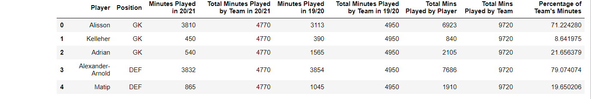

# Introduction

I have been creating the cliche visualisations like scatter plots, bar charts, beeswarms etc. for a while and thought about doing something different. Since I'm an avid football fan, I thought of ideas to represent players' usage or involvement over a period (a season, a couple of seasons). I have seen some cool visualisations like donut which depict usage and I wanted to make something different and simple to understand. I thought about representing batteries as a form of player usage and it made a lot of sense.

For players who have been barely used (played fewer minutes)***.

So, what is the purpose of a battery chart? You can use it to show usage, consumption, involvement, fatigue etc. (anything usage related).

The image below is a sample view of how a battery would look in our figure athough a single battery isn't exactly what we are going to recreate in this tutorial.


# Tutorial

Before jumping on to the tutorial, I would like to make it known that the function can be tweaked to fit accordingly depending on the number of subplots or any other size parameter. Coming to the figure we are going to plot, there are a series of steps that is to be considered which we will follow one by one. The following are those steps:-

1. Outlining what we are going to plot
2. Import necessary libraries
3. Write a function to draw the battery
    - This is the function that will be called to plot the battery chart
4. Read the data and plot the chart accordingly
    - We will demonstrate it with an example


## <span style="text-decoration: underline">Plot Outline</span>

What is our use case?

- We are given a dataset where we have data of Liverpool's players and their minutes played in the last 2 seasons (for whichever club they played in that time period). We will use this data for our visualisation.
- The final visualisation is the featured image of this blog post. We will navigate step-by-step to how we'll create the visualisation.

## <span style="text-decoration: underline">Importing Libraries</span>

The first and foremost part is to import the essential libraries so that we can leverage the functions within. In this case, we will import the following:-

```python
import pandas as pd
import matplotlib.pyplot as plt
from matplotlib.path import Path
from matplotlib.patches import FancyBboxPatch, PathPatch, Wedge
```

The functions imported from `matplotlib.path` and `matplotlib.patches` will be used to draw lines, rectangles, boxes and so on to display the battery as it is.

## <span style="text-decoration: underline">Drawing the Battery - A function</span>

The next part is to define a function named `draw_battery()`,  which will be used to draw the battery. Later on, we will call this function by specifying certain parameters to build the figure as we require. The following below is the code to build the battery -

```python
def draw_battery(fig, ax, percentage=0, bat_ec="grey",
                 tip_fc="none", tip_ec="grey", 
                 bol_fc="#fdfdfd", bol_ec="grey", invert_perc=False):
    '''
    Parameters
    ----------
    fig : figure
        The figure object for the plot
    ax : axes
        The axes/axis variable of the figure.
    percentage : int, optional
        This is the battery percentage - size of the fill. The default is 0.
    bat_ec : str, optional
        The edge color of the battery/cell. The default is "grey".
    tip_fc : str, optional
        The fill/face color of the tip of battery. The default is "none".
    tip_ec : str, optional
        The edge color of the tip of battery. The default is "grey".
    bol_fc : str, optional
        The fill/face color of the lighning bolt. The default is "#fdfdfd".
    bol_ec : str, optional
        The edge color of the lighning bolt. The default is "grey".
    invert_perc : bool, optional
        A flag to invert the percentage shown inside the battery. The default is False

    Returns
    -------
    None.

    '''
    try:
        fig.set_size_inches((15,15))
        ax.set(xlim=(0, 20), ylim=(0, 5))
        ax.axis("off")
        if invert_perc == True:
            percentage = 100 - percentage
        # color options - #fc3d2e red & #53d069 green & #f5c54e yellow
        bat_fc = "#fc3d2e" if percentage <= 20 else "#53d069" if percentage >= 80 else "#f5c54e"
        
        '''
        Static battery and tip of battery
        '''
        battery = FancyBboxPatch((5, 2.1), 10, 0.8, 
                                 "round, pad=0.2, rounding_size=0.5",
                                 fc="none", ec=bat_ec, fill=True,
                                 ls="-", lw=1.5)
        tip = Wedge((15.35, 2.5), 0.2, 270, 90, fc="none", 
                    ec=bat_ec, fill=True,
                    ls="-", lw=3)
        ax.add_artist(battery)
        ax.add_artist(tip)
        
        '''
        Filling the battery cell with the data
        '''
        filler = FancyBboxPatch((5.1, 2.13), (percentage/10)-0.2, 0.74, 
                                "round, pad=0.2, rounding_size=0.5", 
                                fc=bat_fc, ec=bat_fc, fill=True,
                                ls="-", lw=0)
        ax.add_artist(filler)
        
        '''
        Adding a lightning bolt in the centre of the cell
        '''
        verts = [
            (10.5, 3.1), #top
            (8.5, 2.4), #left
            (9.5, 2.4), #left mid
            (9, 1.9), #bottom
            (11, 2.6), #right 
            (10, 2.6), #right mid
            (10.5, 3.1), #top
        ]

        codes = [
            Path.MOVETO,
            Path.LINETO,
            Path.LINETO,
            Path.LINETO,
            Path.LINETO,
            Path.LINETO,
            Path.CLOSEPOLY,
        ]
        path = Path(verts, codes)
        bolt = PathPatch(path, fc=bol_fc,
                         ec=bol_ec, lw=1.5)
        ax.add_artist(bolt)
    except Exception as e:
        import traceback
        print("EXCEPTION FOUND!!! SAFELY EXITING!!! Find the details below:")
        traceback.print_exc()

```

## <span style="text-decoration: underline">Reading the Data</span>

Once we have created the API or function, we can now implement the same. And for that, we need to feed in required data. In our example, we have a dataset that has the list of Liverpool players and the minutes they have played in the past two seasons. The data was collected from <a href="www.fbref.com">Football Reference aka FBRef</a>.

We use the read excel function in the pandas library to read our dataset that is stored as an excel file.

```python
data = pd.read_excel("Liverpool Minutes Played.xlsx")
```

Now, let us have a look at how the data looks by listing out the first five rows of our dataset -

```python
data.head()
```


## <span style="text-decoration: underline">Plotting our data</span>

Now that everything is ready, we go ahead and plot the data. We have 25 players in our dataset, so a 5 x 5 figure is the one to go for. We'll also add some headers and set the colors accordingly.

```python
fig, ax = plt.subplots(5, 5, figsize=(5, 5))
facecolor = "#00001a"
fig.set_facecolor(facecolor)
fig.text(0.35, 0.95, "Liverpool: Player Usage/Involvement", color="white", size=18, fontname="Libre Baskerville", fontweight="bold")
fig.text(0.25, 0.92, "Data from 19/20 and 20/21 | Battery percentage indicate usage | less battery = played more/ more involved", color="white", size=12, fontname="Libre Baskerville")
```

After getting the headers, figure size etc done, we will now plot all the axes i.e. batteries for each and every player. `p` is the variable used to iterate through the dataframe and fetch each players data. The `draw_battery()` function call will obviously plot the battery. We also add the required labels along with that - player name and usage rate/percentage in this case. 

```python
p = 0 #The variable that'll iterate through each row of the dataframe (for every player)
for i in range(0, 5):
    for j in range(0, 5):
        ax[i, j].text(10, 4, str(data.iloc[p, 0]), color="white", size=14, fontname="Lora", va='center', ha='center')
        ax[i, j].set_facecolor(facecolor)
        draw_battery(fig, ax[i, j], round(data.iloc[p, 8]), invert_perc=True)
        '''
        Add the battery percentage as text if a label is required
        '''
        ax[i, j].text(5, 0.9, "Usage - "+ str(int(100 - round(data.iloc[p, 8]))) + "%", fontsize=12, color="white")
        p += 1
```

Now that everything is almost done, we do some final touchup and this is a completely optional part anyway. Since the visualisation is focused on Liverpool players, I add Liverpool's logo and also add my watermark. Also, crediting the data source/provider is more of an ethical habit, so we go ahead and do that as well before displaying the plot.

```python
liv = Image.open('Liverpool.png', 'r')
liv = liv.resize((80, 80))
liv = np.array(liv).astype(np.float) / 255
fig.figimage(liv, 30, 890)
fig.text(0.11, 0.08, "viz: Rithwik Rajendran/@rithwikrajendra", color="lightgrey", size=14, fontname="Lora")
fig.text(0.8, 0.08, "data: FBRef/Statsbomb", color="lightgrey", size=14, fontname="Lora")
plt.show()
```

So, we have the plot below. You can customise the design as you want in the `draw_battery()` function - change size, colours, shapes etc

